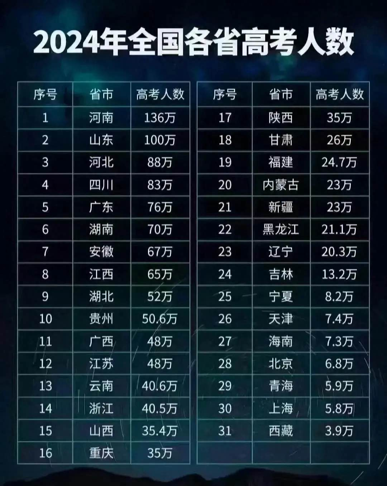
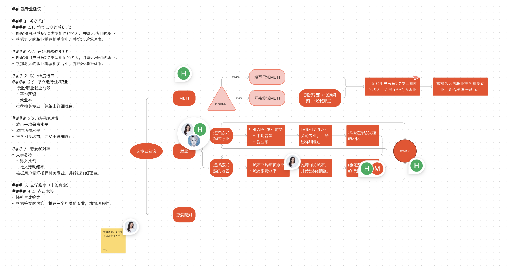
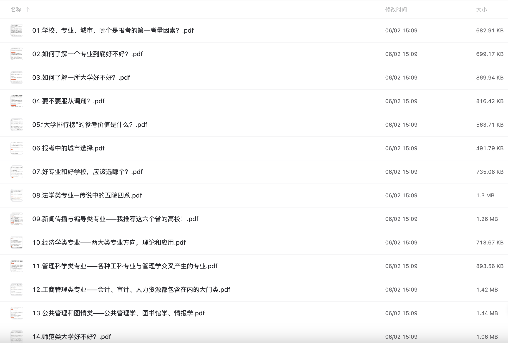
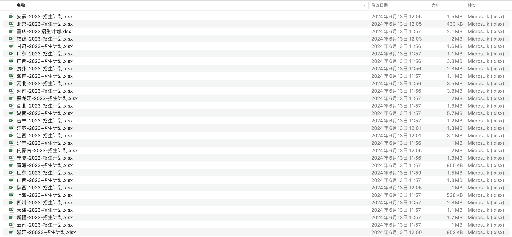
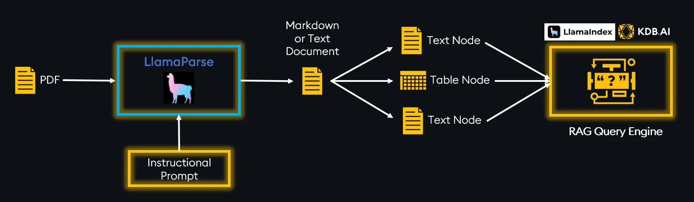
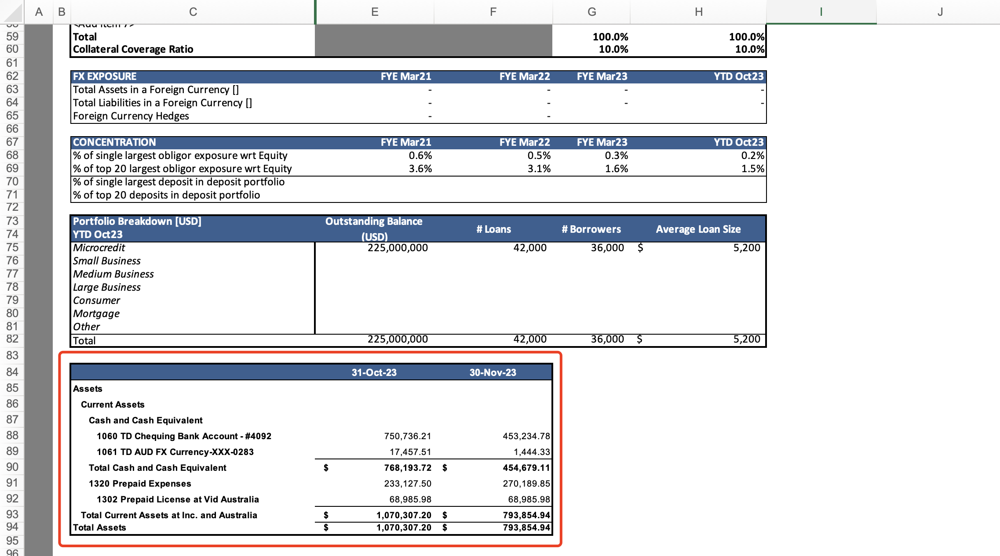
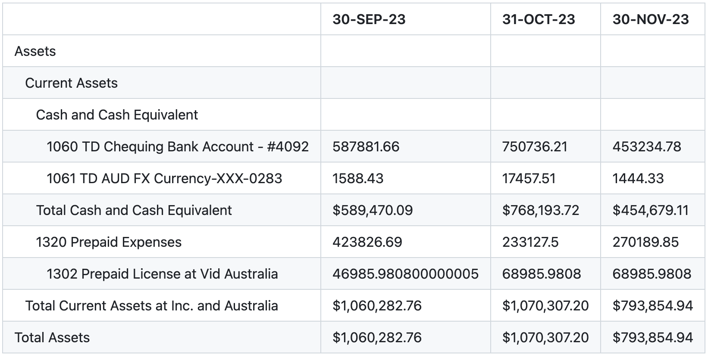

# 小鲤AI志愿填报助手：一键探索最适合你的大学专业

## 背景

每年六月，随着高考的落幕，一个新的挑战随之而来——如何在全国范围内的激烈竞争中抢占一席之地。今年，超过**1300万**的学生参加了这场决定未来命运的考试，每一个人都希望能进入心仪的**大学**，学习理想的**专业**。然而，选择的过程并不简单，错综复杂的`分数线`、众多的`院校`和`专业`以及`地域`和`预算`的限制，构成了一张巨大的迷宫。在这个迷宫中，每一步选择都可能影响未来职业路径和生活质量。

<div align="center">

</div>

面对这样的压力，许多家庭投入大量时间和资源来研究和规划，试图找到一条最佳路径。而现在，`Newmoney社群`带来了一个新的工具——**小鲤AI志愿填报助手**，它利用先进的数据分析和AI技术，帮助学生和家长在这个复杂的决策过程中找到明确的方向。

## 产品设计

`Newmoney社区`通过线上、线下渠道收集了大量高考填报志愿填报的相关信息，通过**数据分析+AI技术**，为用户提供个性化的专业推荐。用户需要输入自己的**MBTI性格类型**、**成绩**、**兴趣**等信息。这些数据帮助AI系统精确分析，推荐最适合用户的专业路径，同时提供每个专业的详细信息，如职业前景和名人案例，帮助用户做出明智的选择。

<div align="center">

</div>

在前述基础上，我们可以进一步细化和补充每个功能，以确保整体描述的风格一致性并且信息更加全面和详细：

### **多维度评估**

`Newmoney社区`通过广泛的数据收集和深入的分析，提供了以下详尽的多维度评估，以全面了解各`专业`和`学校`的实况：

- **课程内容与教学方法**：评估学校提供的课程内容的`广度`和`深度`，以及教学方法的`现代性`和`创新性`，例如项目式学习、在线教学资源和实践实习机会。
- **就业数据分析**：我们不仅提供每个专业的`市场前景分析`，还结合`行业增长速度`和`岗位需求的变化`，使用最新的`就业报告`和`薪资数据`，为学生规划稳健的职业道路。
- **学校生活环境**：基于`在校大学生`和`校友`的反馈，我们详细评估每个学校的`食堂`、`住宿条件`、`安全`和`社交活动`等，确保学生能全方位了解未来的学习和生活环境。此外，我们还特别分析了学校的`男女比率`和`谈恋爱的难易度`，帮助学生从社交层面做出选择。
- **地理优势分析**：通过评估每个城市或地区的`经济状况`、`文化氛围`和`教育资源`，我们帮助学生了解不同地区的教育优势及其对个人学习和生活的潜在影响。
- **国际化程度**：考察学校的国际合作和交流项目，包括`国际学生比例`、`国际学术合作`和`海外交换机会`，这些因素对提升学生的全球视野和适应国际环境的能力至关重要。

### **趣味性和互动性**

我们的系统设计了多元化的趣味性和互动性功能，以增加用户体验的乐趣并促进社区内的交流：

- **玄学维度**：引入一种全新的、类似求签的体验方式，用户通过随机生成的签文来获取专业推荐，这不仅增添了决策过程的趣味性，还可能开启对未考虑过专业的新见解。
- **社交功能**：我们的AI助手允许用户在选择专业和学校过程中分享自己的决策和结果，通过论坛和评论功能，用户可以与其他学生交流想法和经验，从而形成一个互帮互助的学习社区。

### **专业选择建议**

我们的系统提供综合且多角度的专业选择建议，帮助用户从个人喜好到市场趋势全面考虑：

- **MBTI匹配**：通过与用户的MBTI性格类型相匹配的名人职业进行对比，我们推荐相关专业，并详细说明为何这些专业适合用户的性格特点和潜在优势。
- **就业维度选择**：用户根据自己对特定行业或职业的兴趣进行选择，我们提供深入的就业前景分析，包括平均薪资、就业率和行业未来发展趋势，确保推荐的专业与市场需求相符。
- **未来技术适应性**：分析和推荐那些对未来技术变化具有高度适应性的专业，如人工智能、可再生能源和生物技术，帮助学生为快速变化的职业市场做好准备。
- **恋爱配对率**：特别分析了大学的男女比例和社交活动的频率，提供这些数据帮助用户评估学校的社交环境，从而做出更符合个人社交需求的专业选择。
- **创业支持与创新潜力**：为有志于创业的学生提供关于各专业创业支持和创新潜力的信息，评估学校提供的创业孵化器、投资机会和创业竞赛等。

<div align="center">

</div>

通过这些精心设计的功能和评估，`小鲤AI志愿填报助手`为学生提供了一个数据驱动、全面且互动性强的AI工具，帮助他们在高考后做出最适合自己的专业选择。

<div align="center">

</div>


## 技术调研

考虑到高考分数很快就要出来了，`Newmoney社区`面临着快速开发和上线`小鲤AI志愿填报助手`的紧迫任务。团队内部沟通后决定采用[RAG-GPT](https://github.com/gpt-open/rag-gpt)框架，结合`检索增强的生成模型（RAG）`与`大型语言模型（LLM）`技术，来快速搭建**MBTI Agent**和**专业填报Bot**。这两个系统将成为用户互动的核心，提供基于MBTI个性类型的职业匹配和基于AI数据分析的专业推荐。

### 技术挑战及其解决方案

#### **1. 数据清洗**
**挑战**：收集到的数据多来源于`PDF`和`Excel`文件，含有大量`非结构化`或`半结构化`信息，需要快速且准确地清洗和格式化。

<div align="center">

</div>

<br />

<div align="center">

</div>

**解决方案**：引入[LlamaParse](https://docs.cloud.llamaindex.ai/llamaparse/getting_started)来提取PDF和Excel中的`文本`、`表格`、`图片`等信息，并使用Python的`openpyxl`库对Excel文件中的表格做定制化处理，自动化初步的数据清洗工作，同时建立一套清洗规则确保数据质量。

<div align="center">

</div>

为了高效提取EXCEL表格中的数据，[RAG-GPT](https://github.com/gpt-open/rag-gpt)结合`LlamaParse`和`openpyxl `做了专门的定制优化，确保表格内容完整提取，并且保留EXCEL中单元格的展示样式。

```python
from collections import OrderedDict
from datetime import datetime
from typing import Any, Dict, List, Tuple
import openpyxl
from openpyxl.cell.cell import Cell
from openpyxl.worksheet.worksheet import Worksheet
import pandas as pd


class ExcelTableProcessor:
    def __init__(self, file_path: str) -> None:
        self.file_path = file_path
        self.wb = openpyxl.load_workbook(self.file_path, data_only=True)

    def process_sheets(self) -> Dict[str, List[str]]:
        results = OrderedDict()
        for sheetname in self.wb.sheetnames:
            sheet = self.wb[sheetname]
            tables = self.identify_tables(sheet)
            results[sheetname] = tables
        return results

    def format_cell_value(self, cell: Cell) -> str:
        """Format the value of a cell based on its number_format."""
        value = cell.value
        if value is None:
            return ""

        if cell.is_date:
            # Date formatting
            date_format = {
                'd-mmm-yy': '%d-%b-%y',
                'mmm-yy': '%b-%y',
                '"FYE"\\ mmmyy': 'FYE %b%y',
                '"YTD"\\ mmmyy': 'YTD %b%y'
            }.get(cell.number_format, '%Y-%m-%d')
            return value.strftime(date_format).upper()
        elif isinstance(value, (int, float)):
            # Number formatting
            if cell.number_format in ['"$"#,##0_);\("$"#,##0\)']:
                formatted_value = f"${value:,.0f}" if value >= 0 else f"(${abs(value):,.0f})"
            elif cell.number_format == '"$"* #,##0.00\\ _€':
                #formatted_value = f"${value:,.2f} €"

                # Adjust for currency symbol and correct alignment
                formatted_value = f"${value:,.2f}"
                # Align the string to the right for a total of 15 characters width
                formatted_value = formatted_value.rjust(15)
            elif cell.number_format == '_("$"* #,##0_);_("$"* \(#,##0\);_("$"* "-"??_);_(@_)':
                # Handle complex currency format with alignment
                if value > 0:
                    formatted_value = f"${value:,.0f}"
                elif value < 0:
                    formatted_value = f"(${abs(value):,.0f})"
                else:  # Assuming zero or other cases
                    formatted_value = f"$ -"
                formatted_value = f"{formatted_value:>15}"  # Align right within 15 character width
            elif cell.number_format == '0%':
                formatted_value = f"{value:.0%}"
            elif cell.number_format == '0.0%':
                formatted_value = f"{value:.1%}"
            else:
                formatted_value = str(value)
            return formatted_value
        else:
            # Convert value to string and preserve leading spaces using HTML non-breaking spaces
            value_str = str(value)
            leading_spaces = len(value_str) - len(value_str.lstrip(' '))
            if leading_spaces:
                preserved_spaces = '&nbsp;' * leading_spaces
                value_str = preserved_spaces + value_str.lstrip(' ')
            return value_str

    def has_required_left_border(self, cell: Cell) -> bool:
        """Check if a cell has the required left border."""
        return cell.border.left.style in ['thin', 'medium', 'thick']

    def has_required_top_border(self, cell: Cell) -> bool:
        """Check if a cell has the required top border."""
        return cell.border.top.style in ['thin', 'medium', 'thick']

    def is_first_header_cell(self, cell: Cell) -> bool:
        """Check if a cell meets the first header characteristics."""
        return self.has_required_left_border(cell) and self.has_required_top_border(cell)

    def find_table(self, sheet: Worksheet, start_row: int, start_col: int) -> Tuple[int, int, int, int]:
        """Identify the width and height of the table starting from a header cell."""
        max_row = sheet.max_row
        max_col = sheet.max_column

        # Identify table width
        n = 1
        while start_col + n <= max_col and self.has_required_top_border(sheet.cell(row=start_row, column=start_col + n)):
            n += 1

        # Identify table height
        m = 1
        while start_row + m <= max_row and self.has_required_left_border(sheet.cell(row=start_row + m, column=start_col)):
            m += 1

        return (start_row, start_col, start_row + m - 1, start_col + n - 1)

    def convert_table_to_markdown(self, sheet: Worksheet, table_range: Tuple[int, int, int, int]) -> str:
        """Convert the specified range of cells into a Markdown formatted table."""
        data = []
        for r in range(table_range[0], table_range[2] + 1):
            row_data = [self.format_cell_value(sheet.cell(row=r, column=c)) for c in range(table_range[1], table_range[3] + 1)]
            data.append(row_data)

        df = pd.DataFrame(data[1:], columns=data[0])
        return df.to_markdown(index=False)

    def identify_tables(self, sheet: Worksheet) -> List[str]:
        """Scan the worksheet for tables and return a list of Markdown formatted tables."""
        sheet = self.wb.active
        max_row = sheet.max_row
        max_col = sheet.max_column
        markdown_tables = []
        processed_cells = set()

        for row in range(1, max_row + 1):
            for col in range(1, max_col + 1):
                cell = sheet.cell(row=row, column=col)
                if (row, col) not in processed_cells and self.is_first_header_cell(cell):
                    table_range = self.find_table(sheet, row, col)
                    markdown_tables.append(self.convert_table_to_markdown(sheet, table_range))
                    # Mark cells as processed
                    for r in range(table_range[0], table_range[2] + 1):
                        for c in range(table_range[1], table_range[3] + 1):
                            processed_cells.add((r, c))
        return markdown_tables
```

当从Excel表格中提取信息时，确保数据的`完整性`和`准确性`至关重要。以下是一些关键点，用于指导数据提取过程中的详细要求：

- **完整性提取**：必须提取Excel表中的所有信息，确保没有任何数据遗漏。
- **格式保持一致性**：在提取过程中需要保证单元格内的内容与原始Excel文件中的展示格式完全一致。
- **缩进信息保留**：对于表格内具有缩进的多行单元格，必须保留这些缩进信息，以保证数据的结构和层次清晰。
- **表格拆分处理**：如果一个Excel工作表中含有多个表格，需要将这些表格分别拆分，以便于后续的数据处理。这一处理在目前使用的`LlamaParse`工具中可能存在困难，需要特别注意。


比如下面的Excel文件中`红色方框`中表格。

<div align="center">

</div>

以下是提取表格，并转换为`markdown`后的文本信息。

```md
|                                                                                             | 30-SEP-23          | 31-OCT-23     | 30-NOV-23   |
|:--------------------------------------------------------------------------------------------|:-------------------|:--------------|:------------|
| Assets                                                                                      |                    |               |             |
| &nbsp;&nbsp;&nbsp;Current Assets                                                            |                    |               |             |
| &nbsp;&nbsp;&nbsp;&nbsp;&nbsp;&nbsp;Cash and Cash Equivalent                                |                    |               |             |
| &nbsp;&nbsp;&nbsp;&nbsp;&nbsp;&nbsp;&nbsp;&nbsp;&nbsp;1060 TD Chequing Bank Account - #4092 | 587881.66          | 750736.21     | 453234.78   |
| &nbsp;&nbsp;&nbsp;&nbsp;&nbsp;&nbsp;&nbsp;&nbsp;&nbsp;1061 TD AUD FX Currency-XXX-0283      | 1588.43            | 17457.51      | 1444.33     |
| &nbsp;&nbsp;&nbsp;&nbsp;&nbsp;&nbsp;Total Cash and Cash Equivalent                          | $589,470.09        | $768,193.72   | $454,679.11 |
| &nbsp;&nbsp;&nbsp;&nbsp;&nbsp;&nbsp;1320 Prepaid Expenses                                   | 423826.69          | 233127.5      | 270189.85   |
| &nbsp;&nbsp;&nbsp;&nbsp;&nbsp;&nbsp;&nbsp;&nbsp;&nbsp;1302 Prepaid License at Vid Australia | 46985.980800000005 | 68985.9808    | 68985.9808  |
| &nbsp;&nbsp;&nbsp;Total Current Assets at Inc. and Australia                                | $1,060,282.76      | $1,070,307.20 | $793,854.94 |
| Total Assets                                                                                | $1,060,282.76      | $1,070,307.20 | $793,854.94 |
```

以下是markdown渲染表格，和原始Excel基本保持一致。

<div align="center">

</div>


#### **2. 知识库建设**

**挑战**：`MBTI Agent`和`专业填报Bot`均需依托于详尽且精确的知识库，这要求知识库不仅要包含广泛的信息，还需保持数据的实时更新和高准确性。

**解决方案**：首先，基于已清洗的数据构建初步的知识库，并利用专家系统进行数据验证和质量控制。接着，实施持续的数据监测和更新机制，确保知识库的信息与当前高考政策和市场状况保持同步。此外，通过[RAG-GPT](https://github.com/gpt-open/rag-gpt)框架的快速学习能力，不断优化知识库内容，增强答案的准确度和相关性。

#### **3. 技术实现：RAG + LLM**

**挑战**：整合`RAG`与`LLM`需要高度的技术集成和优化，尤其是在处理高考相关数据的多样性和复杂性。

**解决方案**：采用敏捷开发方法，快速迭代和测试`RAG`和`LLM`的集成。通过持续的模型训练和微调，提高系统对用户查询的响应效率和准确性。

### 快速开发策略

- **最小可行产品（MVP）**：首先推出包含最核心功能的`MVP`，确保这些功能满足基本的用户需求。
- **功能优先级**：划分功能的优先级，核心功能如数据解析和推荐算法优先开发，非核心功能如社交互动元素可后续逐步推出。
- **资源重新分配**：聚焦关键资源到必要任务，可能的外包或使用云服务以提高开发效率。
- **技术选型**：选择成熟的技术和工具以减少开发风险和提高开发速度。

通过这些措施，Newmoney社区计划在紧张的时间线内，成功开发并上线`小鲤AI志愿填报助手`，同时留有空间针对用户反馈进行产品迭代和优化。这种策略确保了产品尽快面市，同时保留了逐步完善的灵活性。


## 结语

随着`小鲤AI志愿填报助手`的`第一版功能`的成功开发和上线，`Newmoney社区`为高考生提供了一个创新的决策工具，旨在简化他们的志愿填报过程。通过克服众多技术挑战，我们展示了AI技术在教育决策中的巨大潜力。

展望未来，我们将继续优化此AI工具，引入更多个性化功能，以更好地服务学生。我们期待未来在教育技术领域取得更多突破，为学生的学习旅程带来更多的可能性。


## 关于我们

`OpenIM`是领先的开源即时通讯（IM）平台，目前在GitHub上的星标已超过`13k`。随着数据和隐私安全的重视以及信息技术的快速发展，政府和企业对于私有部署的IM需求急剧增长。`OpenIM`凭借“安全可控”的特点，在协同办公软件市场中占据了一席之地。在后`AIGC时代`，`IM`作为人机交互的首要接口，其价值愈发重要，`OpenIM`期待在此时代扮演更关键的角色。

基于这样的视角，我们最近开源了`RAG-GPT`项目，已被部分企业采用并持续完善中。`RAG-GPT`的主要特点包括：

- **内置LLM支持**：支持云端LLM和本地LLM。
- **快速设置**：只需五分钟即可部署生产级对话服务机器人。
- **多样化知识库集成**：支持多种类型的知识库，包括网站、独立URL和本地文件。
- **灵活配置**：提供用户友好的后台，配备可定制的设置以简化管理。
- **美观的用户界面**：具有可定制且视觉上吸引人的用户界面。

GitHub地址： https://github.com/gpt-open/rag-gpt

在线Demo： https://demo.rentsoft.cn/

我们的目标是改进文件管理功能，更有效地管理数据，并整合企业级知识库。欢迎大家在GitHub上Star并关注，支持我们的开源旅程。

开源说明：`RAG-GPT`采用Apache 2.0许可，支持免费使用和二次开发。遇到问题时，请在GitHub提Issue或加入我们的OpenKF开源社区群讨论。如果您需要更智能的客服系统，请与我们联系。

<div align="center">

</div>