# 通过重新排序改进检索增强生成 (RAG)

## 引言

在生成式人工智能（GenAI）的世界里，您经常会遇到RAG（Retrieval Augmented Generation）这个术语。基本上，RAG是关于为大语言模型（LLM）提供额外的相关信息（上下文）以帮助它们生成更好和更相关的响应。

设置一个基本的RAG系统并不复杂，但它通常在提供高度准确的响应方面表现欠佳。主要原因之一是这种设置并不总是为LLM提供最精确的上下文。

在下面的架构图中，只有来自向量搜索的top_k响应被作为上下文传递给LLM。但是，如果有其他返回的向量（如琥珀色）包含了更多与查询相关的信息呢？在这种情况下，我们没有将这些额外的相关信息传递给LLM，这可能会导致LLM生成的响应不够准确。

这里的问题是，仅考虑top_k响应可能会错过那些可以提高LLM响应准确性的有价值的上下文。这一限制突显了需要一种更稳健的方法来选择和提供上下文，以确保LLM能够访问到最相关的信息，从而生成准确的响应。

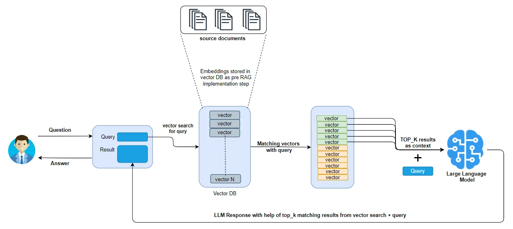

基于向量搜索的RAG实现

## 问题是什么？

在RAG中，主要关注点是对庞大的数据集进行语义搜索，这些数据集可能包含成千上万的文档。为了进行语义搜索，这些文档被转换成向量，使其能够通过相似度度量（如余弦相似度）与查询向量进行比较。

然而，在将文档转换为向量的过程中，信息可能会丢失，因为向量以压缩的数值格式表示内容。此外，较大的文档通常需要分割成较小的块以嵌入到向量格式中，这使得在所有较小部分中保持上下文变得具有挑战性。

在RAG中实施向量搜索时，上下文丢失的问题变得显而易见。这是因为我们通常只考虑向量搜索的top_k结果，可能会忽略落在这个截止线以下的相关信息。因此，当LLM接收到的top_k结果作为上下文可能与查询不完全相关时，可能会导致LLM的响应质量较差。

我们不能简单地将向量搜索的所有搜索结果发送给LLM，原因有两个：

1. **LLM上下文限制**：LLM在传递给它们的文本数量上有约束，称为“上下文窗口”。虽然最近的进展带来了更大的上下文窗口，如Anthropic的Claude的100K tokens或GPT-4的32K tokens，但更大的上下文窗口并不能保证更准确的结果。即使有更大的窗口，LLM能有效处理的信息量仍然有限。
2. **LLM的召回性能**：LLM召回是指模型从给定上下文中检索信息的能力。研究表明，如果在上下文窗口中包含了过多的tokens，LLM的召回性能可能会下降。因此，简单地将更多信息塞入上下文窗口并不是一个可行的解决方案，因为这可能会对LLM的相关信息召回能力产生负面影响。

> 这些观点在这里引用的论文中有更详细的讨论[链接](https://arxiv.org/pdf/2307.03172.pdf)。

到目前为止，很明显，实施RAG不仅仅是将文档存储在向量数据库中并在其上层加上LLM。虽然这种方法可能会产生一些结果，但它在提供生产级性能方面却显得不足。

## 解决方案是什么？

作为改进RAG实现的一部分，一个关键步骤是重新排序（re-ranking）。

重新排序模型是一种计算给定查询和文档对匹配分数的模型。然后可以利用这个分数重新排列向量搜索结果，确保最相关的结果优先排列在列表顶部。

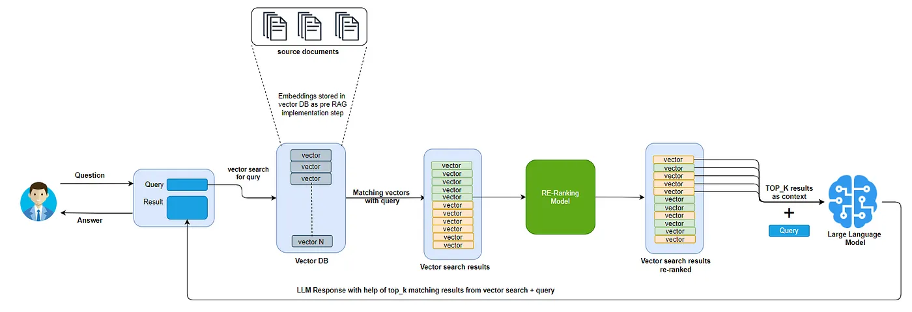

基于向量搜索和重新排序的RAG实现

总结来说，初始步骤是使用向量搜索从大型数据集中检索相关文档，因为它速度很快。一旦获取到这些相关文档，就应用重新排序将最相关的文档优先排列。这些与用户查询密切相关的顶级文档随后被传递给LLM，以提高响应的准确性和精度。

需要注意的是，重新排序模型通常比向量搜索慢。因此，它们不会在找到与用户查询相关的初始文档步骤中使用，以保持效率。

## 实现

让我们使用[Hugging Face dataset](https://huggingface.co/docs/datasets/en/quickstart)库在此示例中利用任何现有的数据集。

我们还将使用Hugging Face上包含机器学习论文的现有数据集。ArXiv的论文似乎是一个很好的来源，因此我们将使用下面返回的第一个数据源。

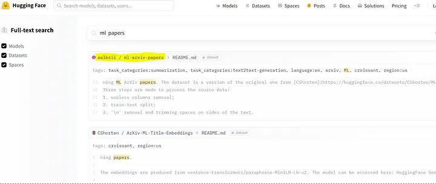

使用Hugging Face的数据集库加载数据集。提到的数据集似乎有超过10万个项目。

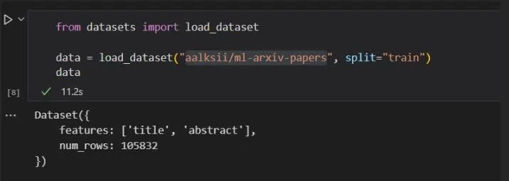

初始化OpenAI和Pinecone对象

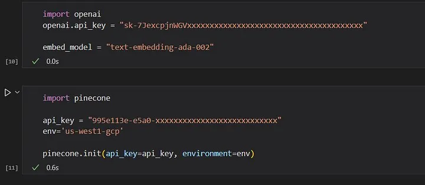

创建Pinecone索引以存储嵌入。我们将创建与嵌入模式相匹配的向量维度的索引。例如，ada-002有1536个向量维度。

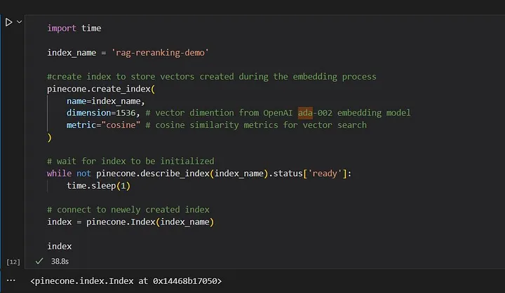

为了有效地存储和管理来自Hugging Face的数据，其中包括“title”和“abstract”等字段，我们将存储“abstract”字段的嵌入在向量数据库中。此外，我们将包括“title”和“metadata”字段，以维护嵌入数据的纯文本表示。这种方法允许在从向量数据库中检索搜索结果时更容易解释与每个向量相关的数据。

为了在向量存储中存储或更新（upsert）记录，同时保留每个记录的元数据，我们需要定义一个对象映射。此映射将使我们能够将每个向量与其对应的元数据（如标题和其他相关信息）相关联。通过建立此映射，我们可以高效地管理和查询数据，同时保留每个记录的重要上下文细节。有关如何执行带有元数据的upsert操作的更多参考资料，您可以查阅[文档](https://docs.pinecone.io/docs/upsert-data)或特定向量数据库的资源。

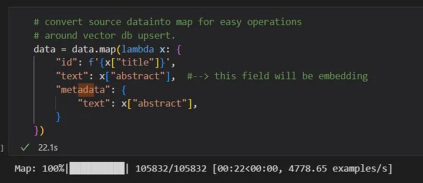

这是一个重要的步骤，我们为输入数据创建嵌入并将嵌入存储在向量数据库中。

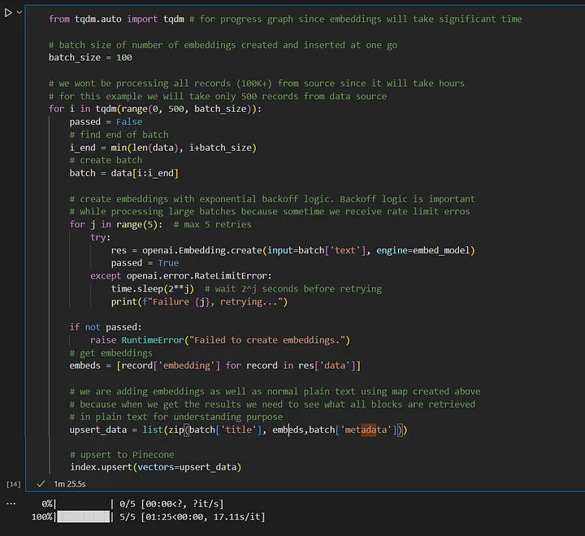

现在，我们将所有数据嵌入到向量数据库中，尝试用一个简单的问题从数据库中查找详细信息，并得到如下所示的前25个匹配向量的结果。

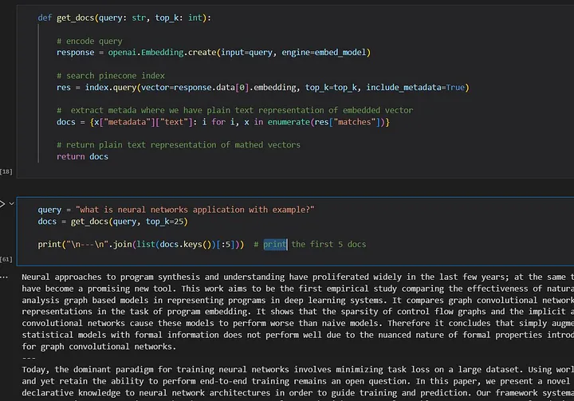

现在，让我们深入探讨对查询返回的匹配向量进行排序的关键方面。

在本讨论中，我们将利用现有的Coher模型进行重新排序，重点放在RAG中的实现上，而不是重新排序模型的构建和训练细节。值得注意的是，有一些方法可以训练定制的重新排序模型，以满足特定需求。

首先，我们将实例化一个Coher重新排序模型，并将其传递给向量搜索返回的项目以及原始查询。这个过程产生了重新排序的结果，增强了返回文档的相关性。

在下面显示的结果块中，编号为11、24和16的项目根据排名似乎最符合查询。通常情况下，这些块可能会在top_k筛选过程中被忽略，可能导致LLM接收到较少相关的上下文。这凸显了重新排序在提高搜索结果相关性方面的重要性。

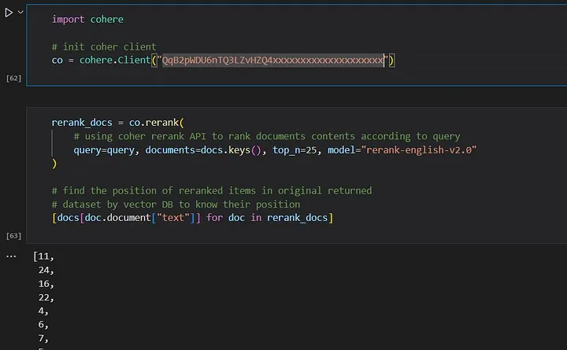

比较普通搜索结果与重新排序后的搜索结果，块的排名发生了显著变化。例如，普通结果中的第0块被重新排序结果中的第11

块取代，第1块被第24块取代，等等。

让我们考虑比较两个块：普通搜索中的第2块与重新排序搜索中的第16块。这种分析显示了一个明显的区别，表明重新排序搜索中的第16块相比于普通搜索中的第2块更符合我们的查询。这样的比较突显了重新排序在提高结果相关性方面的有效性，并确保在将文档作为上下文传递给LLM之前，顶级文档更符合用户的查询。

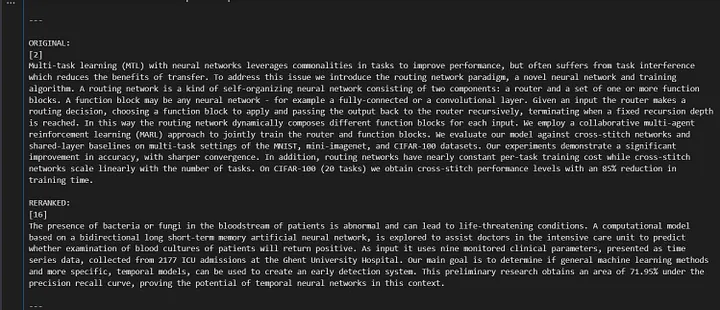


## RAG-GPT中的Reranking

**RAG-GPT**始终秉持用户第一，在引入Reranking策略时，优先考虑轻量简介的模型，降低用户使用成本。
重新排序是更大检索管道的最后一步，目的是避免任何额外的开销，特别是在面向用户的场景中。为此，我们选择了那些占用空间非常小、不需要任何特殊硬件但仍能提供竞争性能的模型。

RAG-GPT中内置了2个Reranking模型：

```python
# Defines the model used for re-ranking.
# 'ms-marco-TinyBERT-L-2-v2': Nano (~4MB), blazing fast model & competitive performance (ranking precision).
# 'ms-marco-MiniLM-L-12-v2': Small (~34MB), slightly slower & best performance (ranking precision).
RERANK_MODEL_NAME = "ms-marco-MiniLM-L-12-v2"
```

具体细节可以参考 [rerank](https://github.com/open-kf/rag-gpt/tree/main/server/rag/post_retrieval/rerank)。


## 结论

总之，本文展示了在RAG框架内重新排序的巨大好处。通过实施重新排序过程，我们观察到检索信息的相关性显著提高。这种改进转化为RAG性能的显著提升，因为我们在最大限度地包含相关信息的同时，减少了输入到LLM中的噪音。

通过我们的探索，我们强调了两阶段检索系统在规模和质量性能方面的优势。使用向量搜索实现了大规模的高效搜索，而引入重新排序确保了只有最相关的文档被优先处理，从而提高了RAG框架内结果的整体质量。


## 关于我们
OpenIM是领先的开源即时通讯（IM）平台，目前在GitHub上的星标已超过13k。随着数据和隐私安全的重视以及信息技术的快速发展，政府和企业对于私有部署的IM需求急剧增长。OpenIM凭借“安全可控”的特点，在协同办公软件市场中占据了一席之地。在后AIGC时代，IM作为人机交互的首要接口，其价值愈发重要，OpenIM期待在此时代扮演更关键的角色。

基于这样的视角，我们最近开源了RAG-GPT项目，已被部分企业采用并持续完善中。RAG-GPT的主要特点包括：

内置LLM支持：支持云端LLM和本地LLM。
快速设置：只需五分钟即可部署生产级对话服务机器人。
多样化知识库集成：支持多种类型的知识库，包括网站、独立URL和本地文件。
灵活配置：提供用户友好的后台，配备可定制的设置以简化管理。
美观的用户界面：具有可定制且视觉上吸引人的用户界面。

GitHub地址： https://github.com/open-kf/rag-gpt

实现方案：https://blog.csdn.net/zhuyingxiao/article/details/138796932

在线 Demo： https://demo.rentsoft.cn/

我们的目标是改进文件管理功能，更有效地管理数据，并整合企业级知识库。欢迎大家在GitHub上Star并关注，支持我们的开源旅程。

开源说明：RAG-GPT采用Apache 2.0许可，支持免费使用和二次开发。遇到问题时，请在GitHub提Issue或加入我们的OpenKF开源社区群讨论。如果您需要更智能的客服系统，请与我们联系。