# 使用RAG-GPT和Ollama搭建智能客服


## 引言

前面介绍了[使用RAG-GPT和OpenAI快速搭建LangChain官网智能客服](https://blog.csdn.net/zhuyingxiao/article/details/139013425)。有些场景，用户可能无法通过往外网访问OpenAI等云端LLM服务，或者由于数据隐私等安全问题，需要本地部署大模型。本文将介绍通过[RAG-GPT](https://github.com/open-kf/rag-gpt)和[Ollama](https://ollama.com/)搭建智能客服。


## RAG技术原理介绍

在介绍RAG-GPT项目之前，我们首先要理解RAG的基本原理，RAG在问答系统中的一个典型应用主要包括三个模块，分别是：

- Indexing（索引）：将文档分割成chunk，编码成向量，并存储在向量数据库中。
- Retrieval（检索）：根据用户输入query和向量数据库中chunks语义相似度检索与问题最相关的前k个chunk，形成本次问答的上下文。
- Generation（生成）：将原始问题和检索到的chunks整合形成合适的prompt一起输入到LLM中，让LLM输出与上下文有关的回答。


<div align="center">

</div>

智能文档的在线检索流程可以用一张图说明，上图中展示了一个完整的问答流程：

- 用户发起query
- 结合Bot实际应用场景，评估是否对query进行rewrite
- Retieval模块根据query检索出Indexing中的相关的文档
- 将召回的文档进行Reranking
-  并且根据relevance score进行过滤，过滤掉低质的文档
- 形成合适的Prompt后输入到LLM大模型中，最后生成答案

以上是对RAG技术的基本介绍，如果想深入了解技术细节可以参考这篇文章：[RAG技术全解析：打造下一代智能问答系统](https://blog.csdn.net/zhuyingxiao/article/details/138796932)。


## 如何快速实现RAG的智能问答系统？
从RAG的原理介绍中可以看到要实现RAG整套架构还是存在一定工作量，需要构建索引、检索、集成LLM、Prompt优化等一系列模块，具有一定的难度。

基于此，RAG-GPT提供了一整套开源解决方案，旨在利用LLM和RAG技术快速搭建一个全功能的客服解决方案。该项目基于Flask框架，包括前端用户界面、后端服务和管理员控制台，为企业利用LLM搭建智能客服等对话场景提供了一个完整的自动化解决方案，可以帮助开发者快速搭建一个智能问答系统，且代码完全开源。
项目地址：https://github.com/open-kf/rag-gpt

### RAG-GPT的基本架构

**RAG-GPT关键特性：**

- **内置LLM支持**：支持云端LLM和本地LLM。
- **快速设置**：只需五分钟即可部署生产级对话服务机器人。
- **多样化知识库集成**：支持多种类型的知识库，包括网站、独立URL和本地文件。
- **灵活配置**：提供用户友好的后台，配备可定制的设置以简化管理。
- **美观的用户界面**：具有可定制且视觉上吸引人的用户界面。

从特性可以知道，RAG相比一些商业收费的基于知识库的问答系统优势在于：

- 易用、快速搭建。
- 能自主管理知识库，避免商业秘密和知识产权泄漏。
- 可以自主选择LLM模型和甚至扩展部署本地模型。


### RAG-GPT 快速搭建智能问答系统

RAG-GPT的基本组成分为三部分：
- 智能问答后端服务
- 管理后台系统
- 用户使用的ChatBot UI。

下面，将介绍如何启动RAG-GPT项目和使用这三个模块，将RAG-GPT集成到你的网站只需要**5个步骤：**

##### 1. 下载源代码，通过Git克隆RAG-GPT的GitHub仓库：

```bash
git clone https://github.com/open-kf/rag-gpt.git && cd rag-gpt
```

##### 2.配置环境变量

> [!NOTE]
> 我们首先需要下载&安装[**Ollama**](https://github.com/ollama/ollama)。
> 然后下载`Embedding模型`和`LLM底座模型`。

**Ollama启动默认**绑定的`IP:PORT`是`127.0.0.1:11434`，可以参考这篇[文档](https://blog.csdn.net/liujianming90/article/details/137452942)修改默认配置。

<div align="center">
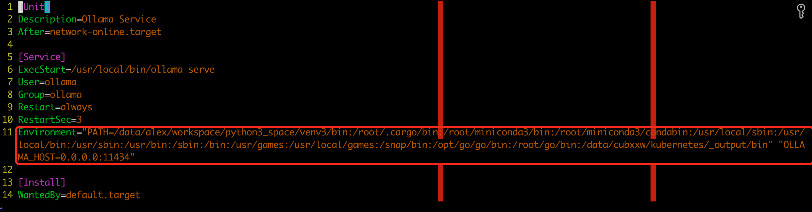
</div>

**Embedding模型**我们选择[**mxbai-embed-large**](https://ollama.com/library/mxbai-embed-large)

<div align="center">
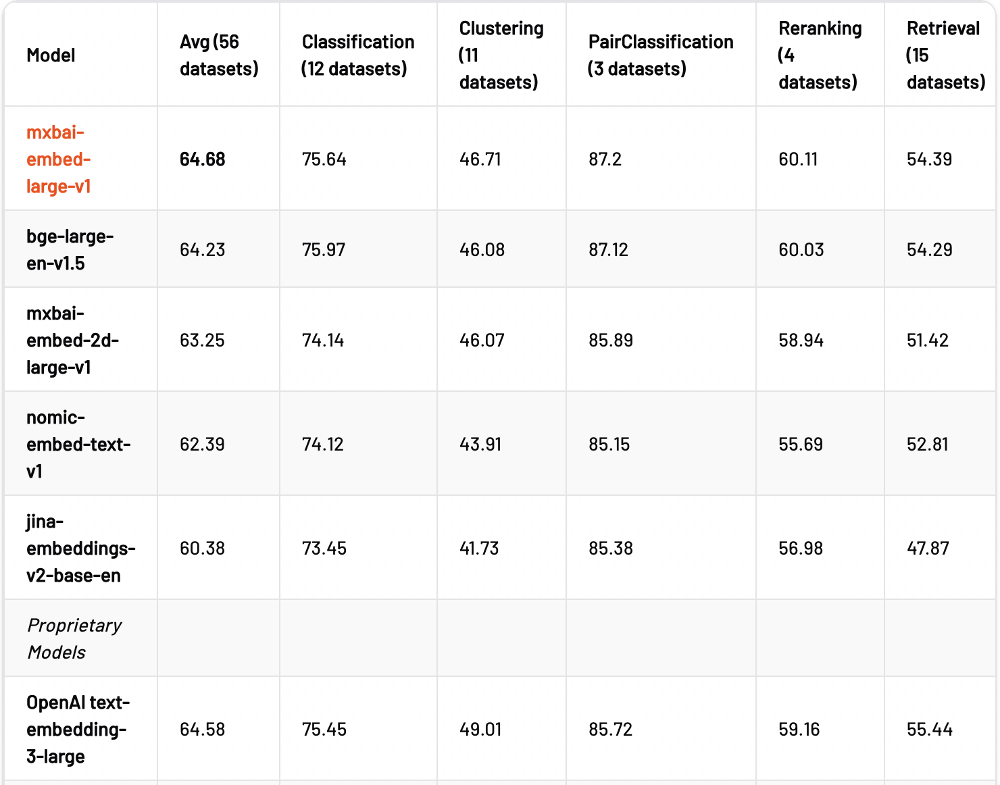
</div>

**LLM底座模型**我们选择[**llama3**](https://ollama.com/blog/llama3)

<div align="center">
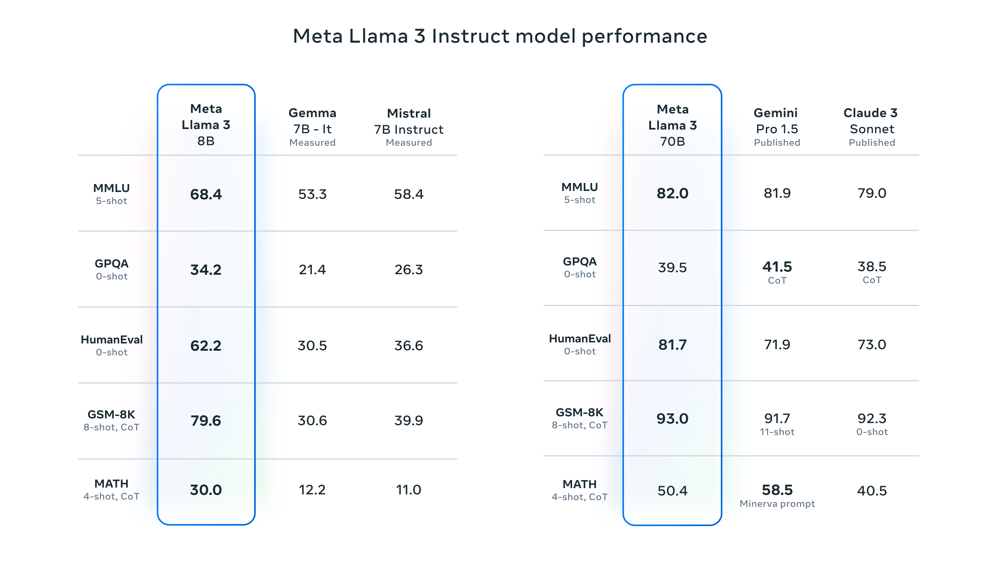
</div>

<div align="center">
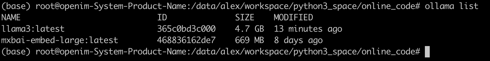
</div>


在启动RAG-GPT服务之前，需要修改相关配置，以便程序正确初始化。

```python
cp env_of_ollama .env
```

.env 文件中的变量

```python
LLM_NAME="Ollama"
OLLAMA_MODEL_NAME="xxxx"
OLLAMA_BASE_URL="http://127.0.0.1:11434"
MIN_RELEVANCE_SCORE=0.3
BOT_TOPIC="OpenIM"
URL_PREFIX="http://127.0.0.1:7000/"
USE_PREPROCESS_QUERY=0
USE_RERANKING=1
USE_DEBUG=0
```

对 .env 中的变量做以下调整：

- 不要修改 **LLM_NAME**。
- 更新 **OLLAMA_MODEL_NAME** 设置，这里我们使用`llama3`，请求和响应的API接口，可以和[OpenAI兼容](https://ollama.com/blog/openai-compatibility)。
- 更新 **OLLAMA_BASE_URL** 设置，我们修改为`http://192.168.2.36:11434`。注意，这里只需要配置`IP:PORT`，尾部不要加上 `/` 或者`其它URI`。
- 将 **BOT_TOPIC** 更改为你的机器人的名称。这非常重要，因为它将在`构造Prompt`中使用。我在这里要搭建关于OpenSSL Cookbook的智能客服，所以改写为`OpenSSL`。
- 调整 **URL_PREFIX** 以匹配你的网站的域名。
- 有关常量的含义和用法的更多信息，可以查看 server/constant 目录下的文件。


##### 3.执行启动命令

分别执行以下命令，即可启动。

> [!NOTE]
> 请使用 Python 3.10.x 或以上版本。

先安装python依赖项

```shell
python3 -m venv myenv
```

```shell
source myenv/bin/activate
```

```shell
pip install -r requirements.txt
```

启动项目即可：

```shell
python create_sqlite_db.py
python rag_gpt_app.py
```

或者执行

```shell
sh start.sh
```

<div align="center">

</div>

##### 4.快速体验聊天效果

- 启动服务后先打开管理后台。

首先要登录到管理后台，浏览器输入：`http://192.168.2.36:7000/open-kf-admin/`
登录账号为：**`admin`** 密码 ：**`open_kf_AIGC@2024`** .

<div align="center">
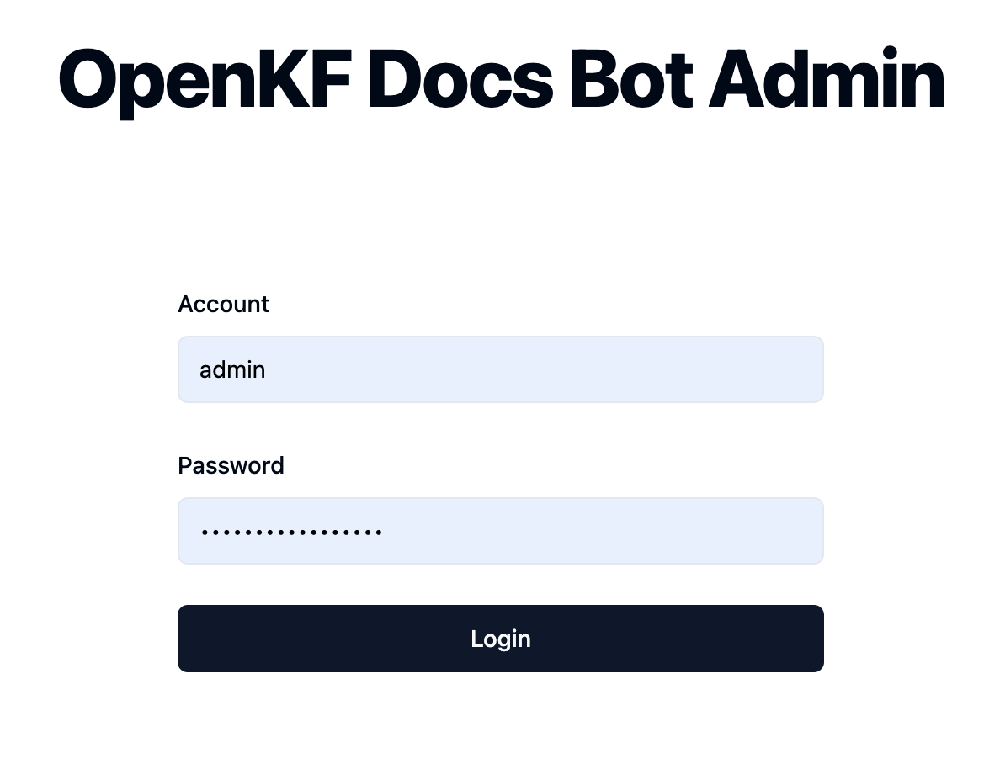
</div>

- 导入知识库，这里上传`openssl-cookbook.pdf`。

在管理后台切换到 `Source` tab，从本地磁盘上传`openssl-cookbook.pdf`，
然后点击 `Upload` 即可一键上传本地文档作为知识库。

<div align="center">
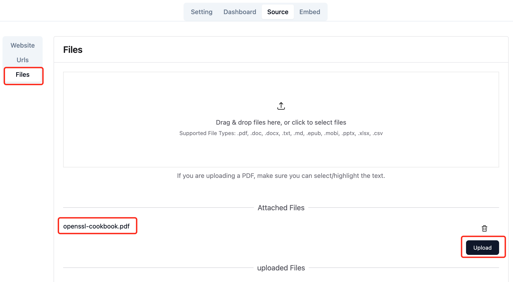
</div>

上传本地文档到服务端后，初始状态是 `Recorded`。 服务端会通过一个异步任务解析上传的文档，并且计算Embedding，然后存入向量数据库。

服务端处理完后，可以看到上传文档的日志。

<div align="center">
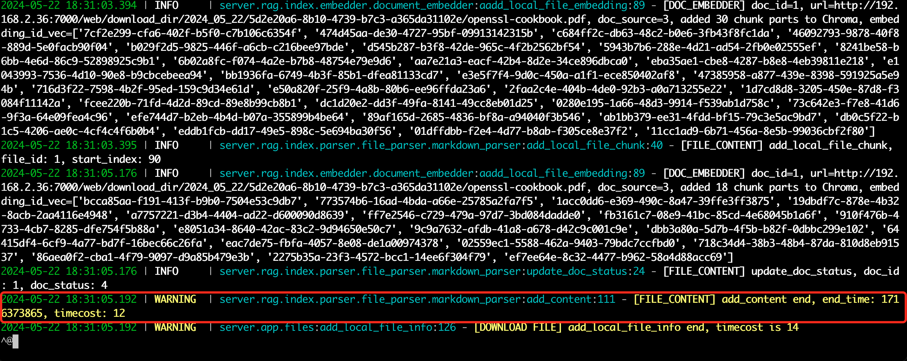
</div>

在admin页面，在管理后台上，上传文档展示的状态都是 `Trained` 。

<div align="center">
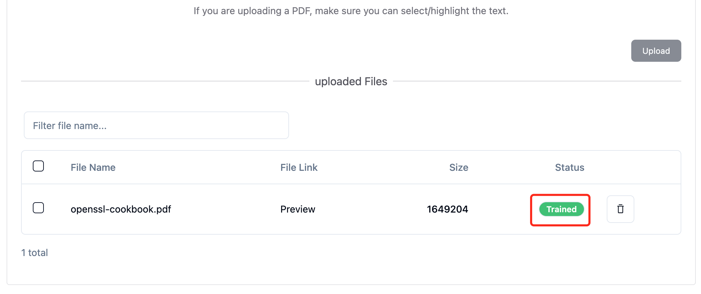
</div>
 
浏览器打开`http://192.168.2.36:7000/open-kf-chatbot/`，就可以访问Bot了。

<div align="center">

</div>

##### 5.一键嵌入到网站

RAG-GPT提供了将聊天机器人嵌入到网站的方法，使得用户可以直接在网站上使用智能问答服务。
打开管理后台菜单切换到embed，复制两个代码即可实现一键嵌入，这两个代码片效果分别如下：一个是iframe嵌入一个聊天窗口，一个是在页面右下角点击弹出聊天窗口。
可以新建一个文本文件，将代码复制进去，用浏览器打开就可以看到嵌入效果了。

<div align="center">
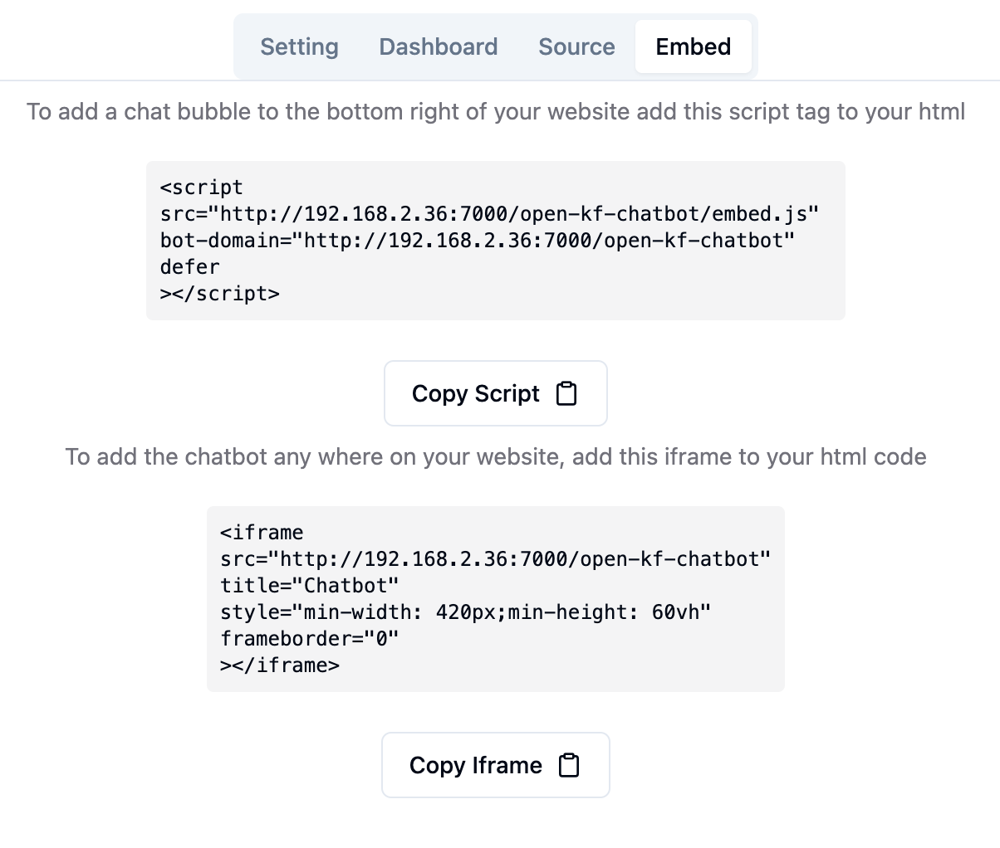
</div>

##### 6.管理后台其他功能

- 管理员可以通过仪表板查看用户的历史请求记录，以便进行分析和优化。

可以按照时间、用户查询聊天记录和修改问答对的答案以更符合自身需求。

<div align="center">
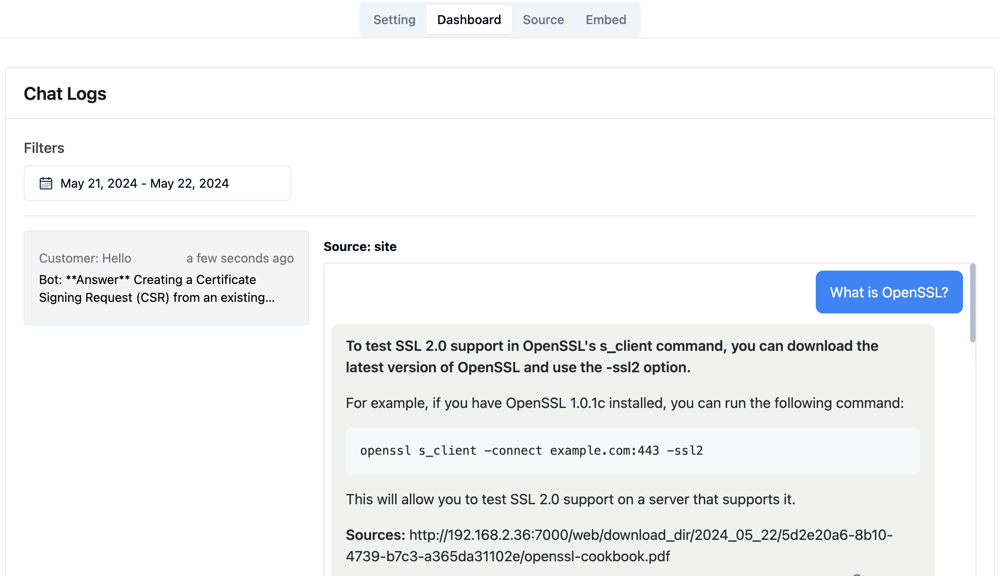
</div>

- 配置聊天对话的UI

用户可以定制化聊天对话框的风格，使其更符合自身网站的风格特性。
     
<div align="center">
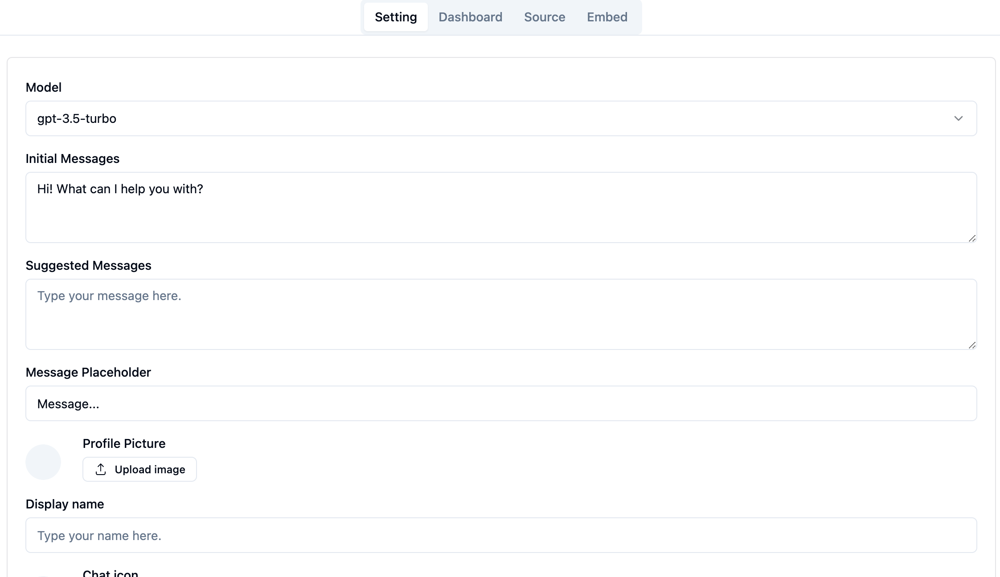
</div>

### 结语

RAG-GPT项目具备开源免费、易于部署集成、开箱即用和功能丰富的特点，为LLM大模型在特定领域的应用落地提供了一套企业级的解决方案。RAG-GPT已经支持本地文件知识库，集成国内LLM大模型等特性，使得RAG-GPT满足更多样化的需求。

### 关于我们

OpenIM是领先的开源即时通讯（IM）平台，目前在GitHub上的星标已超过13k。随着数据和隐私安全的重视以及信息技术的快速发展，政府和企业对于私有部署的IM需求急剧增长。OpenIM凭借“安全可控”的特点，在协同办公软件市场中占据了一席之地。在后AIGC时代，IM作为人机交互的首要接口，其价值愈发重要，OpenIM期待在此时代扮演更关键的角色。

基于这样的视角，我们最近开源了RAG-GPT项目，已被部分企业采用并持续完善中。
如果您对RAG-GPT感兴趣，可以访问以下链接了解更多信息：

项目地址： https://github.com/open-kf/rag-gpt

在线Demo： https://demo.rentsoft.cn/

我们的目标是改进文件管理功能，更有效地管理数据，并整合企业级知识库。欢迎大家在GitHub上Star并关注，支持我们的开源旅程。

开源说明：RAG-GPT采用Apache 2.0许可，支持免费使用和二次开发。遇到问题时，请在GitHub提Issue或加入我们的OpenKF开源社区群讨论。如果您需要更智能的客服系统，请与我们联系。

<div align="center">

</div>
