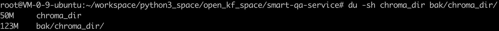
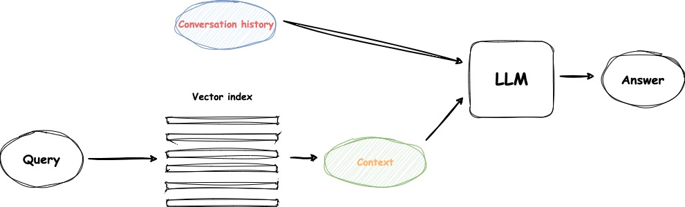

# OpenIM Bot: 用LLM构建企业专属的智能客服

## 背景

随着[**OpenIM**](https://www.openim.io/en)的发展，技术和产品的咨询支持对国内、外的用户变得越来越重要。用户数量的迅速增加，使得OpenIM团队的支持人员面临巨大压力，因为支持人员的数量并没有同步增长。因此，找到一种高效的方法来服务用户成为团队当前迫切需要解决的问题。

通过分析几十个微信群、[Slack社区](https://app.slack.com/client/T054718P6KZ/C054MDK5A9Z)以及Gmail邮箱中收集到的用户问题，发现接近一半的问题其实可以在[OpenIM官网](https://docs.openim.io/)的文档中找到答案。然而，由于官网文档内容庞大，目前已经积累了**800+**网页，用户往往难以快速定位所需信息。因此，构建一个智能客服系统，包含OpenIM官网所有文档的知识库，可以帮助全球用户更便捷地获取信息，更好地了解和使用OpenIM。这个智能客服不仅能减轻支持团队的负担，还能提升用户体验，提高问题解决效率。

## 技术调研

自从`ChatGPT`横空出世以来，其自然、流畅的对话引起了全球的瞩目。基于大语言模型（LLM）搭建的AIGC应用如雨后春笋般涌现，掀起了这波AI新浪潮。对于个人用户来说，`ChatGPT`、`文心一言`以及`豆包`等LLM应用可以直接使用，并能帮忙解决很多问题。然而，对于企业应用来说，情况要复杂得多。实效性、私有数据的处理、幻觉现象和数据安全等问题，都可能成为潜在的隐患。

### LLM问题

在明确需求后，我们需要了解大语言模型（LLM）的特性和限制，以确定其在OpenIM Bot建设中的可行性。仅依靠LLM会面临多种限制，以下四点是最主要的：

- **幻觉问题**：LLM的底层原理基于概率，因此有时会提供不准确的答案。比如我们问ChatGPT-3.5，`“OpenIM是否支持视频会议”`，ChatGPT-3.5可能会因为缺乏特定领域知识而给出错误的答案。这种错误会导致用户对产品产生误解，无法依赖LLM提供的答案。
- **新鲜度问题**：ChatGPT-3.5的训练数据是截至`2021年9月`，任何在此日期之后发生的事件、发布的新技术或新信息，都不在它的知识库中。而且对于一些高时效性的事情，LLM更加无能为力。例如，问ChatGPT-3.5，`“最近有什么演唱会”`，这种任务是需要去大麦、猫眼等平台去获取最新信息，而LLM无法完成。
- **token长度问题**：LLM每轮对话有字符长度限制，如果输入内容超过这个限制，对话将无法继续，可能会导致不完整的回答或对话失败。举例来说，如果用户上传了一段长文本进行分析，LLM可能无法处理全部内容，只能处理部分内容，这会影响回答的完整性和准确性。此外，token的使用量直接影响成本。每次请求都会消耗一定数量的token，特别是在处理长文本或多轮对话时，token费用可能会迅速累积，从而增加运营成本。因此，在使用LLM时，需要平衡回答的全面性和成本，合理控制token的使用量。
- **数据安全问题**：在某些场景下，用户无法通过外网访问OpenAI等云端LLM服务。这可能是由于企业或组织的网络策略限制，禁止访问外部网络以确保内部数据的安全性。此外，即使能够访问外网，用户的敏感数据在传输过程中可能面临被截获或泄露的风险。为了确保数据的隐私和安全，一些企业和组织需要在本地部署大模型，避免数据传输到外部服务器。这种本地部署不仅能确保数据不离开企业内部网络，还能满足合规性要求，特别是在数据敏感行业如金融、医疗和政府机构中。本地部署大模型虽然可以解决数据安全问题，但也带来了额外的硬件、维护和技术支持需求。

### RAG方案

RAG（检索增强生成，Retrieval-Augmented Generation）是一种结合搜索技术和LLM生成能力的方法。其核心理念是通过从数据源中检索相关信息，并将这些信息作为生成答案的基础。具体而言，RAG通过搜索算法找到与查询相关的内容，并将这些内容作为上下文整合到传递给LLM的提示中，进而生成更准确和详细的回答。

随着LLM的广泛应用，RAG架构迅速成为热门技术。许多产品和服务依赖于RAG架构，从结合网络搜索引擎和LLM的问答系统，到各种数据交互应用程序，RAG架构的应用范围越来越广泛。这种方法不仅提升了回答的准确性，还极大地扩展了LLM的功能和应用场景。

<div align="center">

</div>

### OpenIM Bot的需求

针对OpenIM的业务场景，我们希望LLM能够实现以下需求：

- **准确回答相关问题**：对于用户提出的与OpenIM知识点相关的问题，LLM需要提供准确无误的回答，并给出参考的网页链接信息。
- **拒绝回答无关问题**：如果用户提出的问题与OpenIM无关，LLM应拒绝回答，并引导用户咨询与OpenIM相关的问题。
- **澄清未知问题**：如果OpenIM官网的知识库无法回答用户的问题，LLM应直接澄清这一点，而不是捏造答案误导用户。
- **支持多轮对话**：LLM需要支持多轮对话形式，能够理解用户的连续提问，并提供连贯的回答。
- **多语言支持**：LLM需要支持多种语言，并且回答的语言应与用户提问的语言保持一致。

通过满足这些需求，OpenIM Bot将能够有效地提供技术支持和产品咨询，提升用户体验。

<div align="center">

</div>

## 落地实践

### 向量存储

向量存储本质上是专门设计用于高效存储和管理向量的数据库，这些向量是由文本Embedding模型（例如[OpenAI的`text-embedding`](https://platform.openai.com/docs/guides/embeddings) API）生成的高维数组。

在OpenIM Bot中，向量存储在增强LLM的能力方面发挥了关键作用。以下是详细的过程：

1. **向量生成**：每当与OpenIM相关的新内容引入或现有内容更新时，我们使用文本Embedding模型将这些文本信息转换为向量。每个向量都像是其对应文本的唯一指纹，在高维空间中封装其意义。
2. **相似性搜索**：存储这些向量的核心用途在于当我们需要找到与用户查询相关的信息时。通过使用相同的Embedding模型将用户的问题转换为向量，我们可以在向量存储中执行相似性搜索。此搜索通过在Embedding空间中计算向量之间的距离来识别与查询最接近的向量（及文档）。
3. **上下文检索和增强**：通过相似性搜索检索到的文档是有助于语言模型生成相关答案的相关信息。通过提供这些上下文，我们使语言模型能够生成不仅准确且由我们数据库中最新的、最相关的信息支持的响应。

**OpenIM官网知识库建设**

我们需要将 `https://www.openim.io/` 和 `https://docs.openim.io/` 这两个域名下的所有官方文档导入到向量数据库中。

在此过程中，需要注意以下几点：

- **预处理文档**：如果文档质量较差或格式不符合预期，我们首先会对文档进行预处理。预处理包括清理文本，去除无关内容，确保文档转换为干净、易于LLM理解的格式（可以统一转为`Markdown格式`）。
- **Chunking**：如果文档长度超过LLM单次对话的限制，我们需要对文档进行切分。可以采用多种切分方法，例如按特定字符（如逗号、句号、分号）进行切分，或按文本长度切分，确保每段文本都在允许的长度范围内。

```python
class MarkdownTextSplitter(RecursiveCharacterTextSplitter):
    def __init__(self,
        separators: Optional[List[str]] = None,
        keep_separator: bool = True,
        is_separator_regex: bool = True,
        is_remove_empty_line: bool = True,
        **kwargs: Any,
    ) -> None:
        """Create a new TextSplitter."""
        super().__init__(keep_separator=keep_separator, **kwargs)
        self._separators = separators or [
            "\n\n",
            "\n",
            "。|！|？",
            "\.\s|\!\s|\?\s",
            "；|;\s",
            "，|,\s"
        ]
        self._is_separator_regex = is_separator_regex
        self._is_remove_empty_line = is_remove_empty_line
```

通过以上步骤，我们可以确保知识库中的文档高质量、格式统一，并且适合LLM处理，从而为 OpenIM Bot 提供准确可靠的知识基础。

在实际操作过程中，我们积累了一些有价值的经验教训。通过爬虫抓取网页后，将其中的文本内容抽取并转换为`Markdown格式`。`https://docs.openim.io/` 的每个网页都有一个导航目录。在最初的尝试中，我们没有对这部分内容进行特殊处理，而是尽可能地保留网页上的所有文本信息。然而，在测试过程中我们发现，对于某些查询，召回的文档几乎全部是这些导航目录的内容，导致 LLM 无法根据这些内容生成有效的答案。

例如，网页 `https://docs.openim.io/sdks/api`
<div align="center">

</div>

对应的部分 chunk 信息。这些 chunk 没有实际用途，但会干扰检索召回，并占用向量数据库的存储资源。

<div align="center">

</div>

为了解决这个问题，我们在处理网页抓取内容时进行了清洗操作。具体方法如下：

```python
async def parse_content(self, html_text: str, url: str) -> List[str]:
    logger.info(f"[CRAWL_CONTENT] parse_content, url: '{url}'")
    try:
        # Use BeautifulSoup to parse HTML content
        soup = BeautifulSoup(html_text, 'html.parser')

        # Remove all the tags that are not meaningful for the extraction
        SCAPE_TAGS = ["nav", "footer", "aside", "script", "style"]
        [tag.decompose() for tag in soup.find_all(SCAPE_TAGS)]
```

通过移除网页中的 `nav` 等标签内容，向量数据库的大小从`123M`减少到`50M`，大幅提升了检索效率和存储利用率。

<div align="center">

</div>

这一经验表明，在抓取和处理网页内容时，对无用信息进行清洗是非常必要的。这不仅可以提升向量数据库的存储效率，还能显著提高检索结果的质量。

### 检索

在LLM应用技术架构中，通过检索上下文来回答用户的问题，是解决大模型“幻觉”问题的有效方案。RAG在LLM中的地位愈发重要，检索召回的质量和用户query的质量直接影响到大模型生成结果的准确性。

随着向量数据库的广泛应用，单纯依靠语义搜索已不能完全满足企业需求。传统的搜索技术（如基于关键词和词频的搜索）再度显示出其价值。因此，混合检索成为RAG中的主流。混合检索结合了多种搜索技术的优点，能够在不同的业务场景中灵活应用，形成互补，满足多样化的需求，是RAG中关键的一环。

**混合检索结合了以下两种主要搜索技术**：

1. **文本搜索**：基于BM25和TF-IDF算法进行的文本匹配搜索。它在处理特定术语（如产品名称或专业术语）时效果显著，但对拼写错误和同义词较为敏感，可能忽略一些重要的上下文信息。
2. **语义搜索**：使用向量的KNN算法进行的语义搜索。该方法能基于query的语义含义进行多语言、多模态的检索，对拼写错误具有较好的容错性，但有时可能忽视关键字的精确匹配，其效果依赖于向量嵌入的质量，对非专业领域的术语较为敏感。

<div align="center">

</div>


**混合检索的优势**

混合检索结合了相关性搜索和语义搜索的优势，具体表现为：

- **灵活性**：能够根据具体业务场景灵活调整检索策略，既能处理精确匹配，也能理解语义相近的查询。
- **容错性**：语义搜索对拼写错误具有较好的容错性，相关性搜索则能精确匹配特定关键词。
- **综合性**：通过结合不同的搜索方法，可以更全面地覆盖用户查询，提升召回结果的准确性和相关性。

 
**主流向量数据库介绍**

不同的向量数据库在功能和应用场景上有各自的特点，以下是一些主要的向量数据库及其支持的检索类型：

1. **Chroma**
    - **支持类型**：语义检索。
    - **特点**：Chroma是一个轻量级、高效的向量数据库，专注于提供语义搜索功能。它非常适合用作嵌入向量的存储和快速语义检索，但不支持传统的文本相关性搜索。

2. **Elasticsearch**
    - **支持类型**：混合检索。
    - **特点**：Elasticsearch是一个强大的搜索引擎，支持全文搜索和向量搜索。通过结合BM25算法进行相关性搜索和向量搜索功能，Elasticsearch能够提供混合检索，适用于多种复杂查询场景。

3. **Weaviate**
    - **支持类型**：混合检索。
    - **特点**：Weaviate是一种开源的向量数据库，内置了语义搜索和传统的关键词搜索功能。它支持多模态数据的存储和检索，非常适合需要高精度和多样化搜索需求的应用。

4. **Pinecone**
    - **支持类型**：语义检索。
    - **特点**：Pinecone专注于向量搜索，提供快速、高效的语义检索服务。它通过高效的向量存储和检索技术，为大规模数据的语义搜索提供支持，但不支持关键词相关性搜索。

5. **Milvus**
    - **支持类型**：混合检索。
    - **特点**：Milvus是一个开源的向量数据库，支持大规模向量数据的高效检索。它不仅支持基于向量的语义检索，还能够与其他数据库系统集成，提供混合检索功能。

在实际应用中，根据业务具体场景，选择合适的向量数据库，可以起到事半功倍的效果。


**召回过滤**

为了实现**只回答OpenIM相关的问题**，我们目前采取的策略，是设置召回文档的`relevance score`（取值范围是`[0~1]`）的阈值。对于低于阈值的文档，判断为低质文档，不参与后面的LLM生成prompt的构建中。阈值具体的大小，需要根据实际业务场景的测试结果来设置，OpenIM Bot中设置的阈值是`0.5`。

```python
def filter_documents(results: List[Tuple[Document, float]], min_relevance_score: float) -> List[Tuple[Document, float]]:
    filter_results = []
    for doc, score in results:
        if score >= min_relevance_score:
            filter_results.append((doc, score))
    return filter_results
```

**Reranking**

在RAG中实施向量搜索时，上下文丢失的问题变得显而易见。这是因为我们通常只考虑向量搜索的Top K结果，可能会忽略落在这个截止线以下的相关信息。因此，当LLM接收到的top_k结果作为上下文可能与查询不完全相关时，可能会导致LLM的响应质量较差。

我们不能简单地将向量搜索的所有搜索结果发送给LLM，原因有两个：

1. **LLM上下文限制**：LLM在传递给它们的文本数量上有约束，称为`“上下文窗口”`ß。虽然最近的进展带来了更大的上下文窗口，如`Anthropic的Claude的100K tokens`或`GPT-4的32K tokens`，但更大的上下文窗口并不能保证更准确的结果。即使有更大的窗口，LLM能有效处理的信息量仍然有限。
2. **LLM的召回性能**：LLM召回是指模型从给定上下文中检索信息的能力。研究表明，如果在上下文窗口中包含了过多的tokens，LLM的召回性能可能会下降。因此，简单地将更多信息塞入上下文窗口并不是一个可行的解决方案，因为这可能会对LLM的相关信息召回能力产生负面影响。

作为改进RAG实现的一部分，一个关键步骤是重新排序（Reranking）。
重新排序模型是一种计算给定查询和文档对匹配分数的模型。然后可以利用这个分数重新排列向量搜索结果，确保最相关的结果优先排列在列表顶部。

**OpenIM Bot中的Reranking**

[RAG-GPT](https://github.com/open-kf/rag-gpt)始终秉持用户第一，在引入Reranking策略时，优先考虑轻量简介的模型，降低用户使用成本。
重新排序是更大检索管道的最后一步，目的是避免任何额外的开销，特别是在面向用户的场景中。为此，我们选择了那些占用空间非常小、不需要任何特殊硬件但仍能提供竞争性能的模型。

```python
def rerank_documents(query: str, results: List[Tuple[Document, float]]) -> List[Dict[str, Any]]:
    passages: List[Dict[str, Any]] = []
    index = 1
    for doc, chroma_score in results:
        item = {
            "id": index,
            "text": doc.page_content,
            "metadata": doc.metadata,
            "chroma_score": chroma_score
        }
        index += 1
        passages.append(item)

    rerank_results = []
    if passages:
        beg_time = time.time()
        rerankrequest = RerankRequest(query=query, passages=passages)
        rerank_results = reranker.rerank(rerankrequest)
        timecost = time.time() - beg_time
        logger.warning(f"For the query: '{query}', rerank_documents, the timecost is {timecost}")

    return rerank_results
```

RAG-GPT中内置了2个Reranking模型：

```python
# Defines the model used for re-ranking.
# 'ms-marco-TinyBERT-L-2-v2': Nano (~4MB), blazing fast model & competitive performance (ranking precision).
# 'ms-marco-MiniLM-L-12-v2': Small (~34MB), slightly slower & best performance (ranking precision).
RERANK_MODEL_NAME = "ms-marco-MiniLM-L-12-v2"
```

具体细节可以参考 [rerank](https://github.com/open-kf/rag-gpt/tree/main/server/rag/post_retrieval/rerank)。


### 查询分析

用户并不总是最好的提问者，很容易遗漏一些上下文或措辞不当的问题。我们可以确信，LLM不会犯这个错误。此外，考虑到聊天历史（始终作为上下文传递给模型），我们可能不需要包含问题的某些部分，或者相反，我们需要澄清额外的信息。

这样做有助于形成更好的问题，而无需依赖用户来完成。

<div align="center">

</div>

我们不对初始问题执行此操作，主要有两个原因：

1. **速度**：尽管模型越来越快，但它们仍然比我们希望的返回响应时间要长。对于第一个问题，这一点尤为重要，因为聊天机器人尚未向用户证明其有用性，我们不希望在用户甚至还没开始时就因速度问题而失去他们。
2. **上下文**：没有聊天历史，模型缺乏关于用户问题的一些重要上下文。

大多数用户不会完美地为LLM格式化他们的查询，这没关系。
为了解决这个问题，我们在最终生成之前有一个额外的步骤，将用户的查询重新措辞，使其更适合LLM。

prompt非常简单，不过确实有不错的提升效果。

```python
prompt = f"""Given a conversation (between Human and Assistant) and a follow up message from Human, using the prior knowledge relationships, rewrite the message to be a standalone and detailed question that captures all relevant context from the conversation. Ensure the rewritten question:
1. Preserves the original intent of the follow-up message.
2. If the true intent of the follow-up message cannot be determined, make no modifications to avoid generating an incorrect question.
3. The length of the rewritten question should not increase significantly compared to the follow-up message, to avoid altering the original intent.
4. Do not directly use the content of the Assistant's responses to form the rewritten question. Prioritize referring to the information of the Human's historical question.
5. Maintains the same language as the follow-up message (e.g., reply in Chinese if the question was asked in Chinese and in English if it was asked in English).

Chat History (Sorted by request time from most recent to oldest):
{history_context}

Follow Up Input: {query}

**NOTE:** The detected language of the Input is '{lang}'. Please respond in '{lang}'.

Refined Standalone Question:"""
```

通过这样做，语言模型能够接受用户的问题以及包含其他问题、答案和上下文的完整聊天历史，并生成更完善的响应。现在，使用这个重新措辞的问题，我们可以使用这个问题在向量存储中执行相似性搜索，通常可以获得更好的结果，因为这个问题在语义上更类似于之前的问题/答案。

```python
def get_recall_documents(current_query, refined_query, k, user_id, min_relevance_score: float) -> List[Tuple[Document, float]]:
    if current_query == refined_query:
        ret = search_documents(current_query, k)
        results = filter_documents(ret, min_relevance_score)
        return results

    with ThreadPoolExecutor() as executor:
        future_ret1 = executor.submit(search_documents, current_query, k)
        future_ret2 = executor.submit(search_documents, refined_query, k)

        ret1 = filter_documents(future_ret1.result(), min_relevance_score)
        ret2 = filter_documents(future_ret2.result(), min_relevance_score)

        ret = ret1 + ret2
        results = []
        source_id_set = set()
        for doc, chroma_score in ret:
            source_id = doc.metadata["id"]
            if source_id not in source_id_set:
                source_id_set.add(source_id)
                results.append((doc, chroma_score))
            else:
                logger.warning(f"source_id: '{source_id}' is already existed!")

        return results
```

<div align="center">

</div>


## 后记

OpenIM Bot已经在[OpenIM官网](https://docs.openim.io/)上线了，欢迎大家使用。

总的来说，OpenIM Bot 通过融合先进的LLM和RAG技术，成功地为OpenIM用户提供了高效、智能的支持服务。我们将继续迭代优化，不断提升系统的性能和用户体验，为更多企业应用提供借鉴和参考。


## 关于我们

OpenIM是领先的开源即时通讯（IM）平台，目前在GitHub上的星标已超过13k。随着数据和隐私安全的重视以及信息技术的快速发展，政府和企业对于私有部署的IM需求急剧增长。OpenIM凭借“安全可控”的特点，在协同办公软件市场中占据了一席之地。在后AIGC时代，IM作为人机交互的首要接口，其价值愈发重要，OpenIM期待在此时代扮演更关键的角色。

基于这样的视角，我们最近开源了RAG-GPT项目，已被部分企业采用并持续完善中。RAG-GPT的主要特点包括：

内置LLM支持：支持云端LLM和本地LLM。
快速设置：只需五分钟即可部署生产级对话服务机器人。
多样化知识库集成：支持多种类型的知识库，包括网站、独立URL和本地文件。
灵活配置：提供用户友好的后台，配备可定制的设置以简化管理。
美观的用户界面：具有可定制且视觉上吸引人的用户界面。

GitHub地址： https://github.com/open-kf/rag-gpt

在线 Demo： https://demo.rentsoft.cn/

我们的目标是改进文件管理功能，更有效地管理数据，并整合企业级知识库。欢迎大家在GitHub上Star并关注，支持我们的开源旅程。

开源说明：RAG-GPT采用Apache 2.0许可，支持免费使用和二次开发。遇到问题时，请在GitHub提Issue或加入我们的OpenKF开源社区群讨论。如果您需要更智能的客服系统，请与我们联系。

<div align="center">

</div>