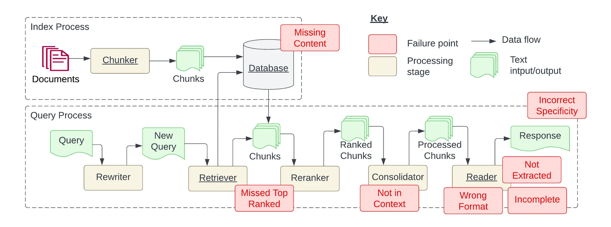
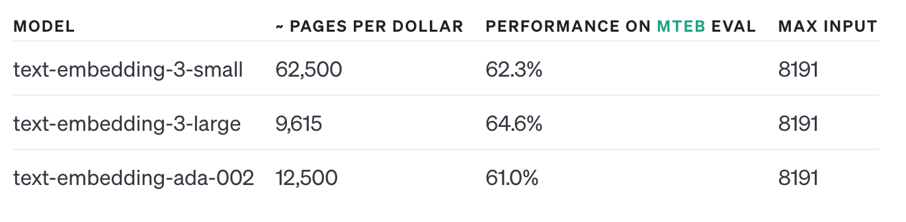
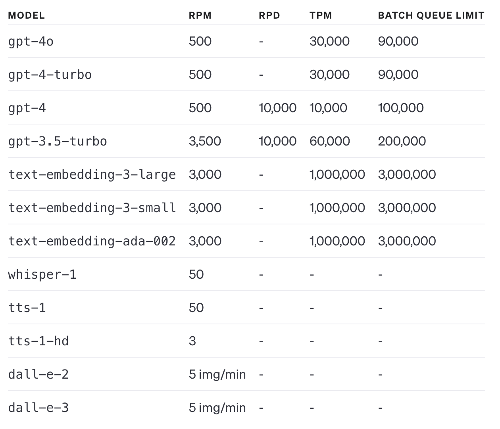
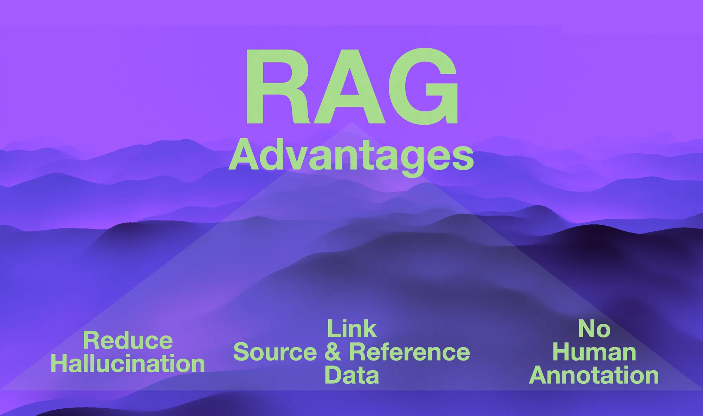

# RAG-GPT实践过程中遇到的挑战

## 引言

大型语言模型(LLM)的新进展，包括ChatGPT，为AI应用提供了新的能力，使其能够`构建新的人机交互解决方案`、`完成复杂任务`、`总结文档`、`回答文献中的问题并生成新内容`。然而，LLM在获取最新知识或企业内部知识库中的领域特定知识时仍存在局限性。
解决此问题的两个选项是：

- **微调LLM**(继续使用特定领域的文献对LLM进行训练)，这需要管理或提供微调后的LLM。
- 使用**检索增强生成(RAG)系统**，依赖LLM使用现有(可扩展的)知识文献生成答案。

这两个选项在`数据隐私/安全性`、`可扩展性`、`成本`、`所需技能`等方面各有优缺点。[**RAG-GPT**](https://github.com/open-kf/rag-gpt)中采用的是RAG系统。在本文中，我们重点讨论RAG选项。

通过结合`检索机制`和`LLM的生成能力`，RAG系统可以生成上下文相关、准确且最新的信息。RAG系统结合了信息检索能力和LLM的生成能力。`检索模块`专注于从数据存储中检索与用户查询相关的信息，`生成模块`则使用检索到的信息作为上下文来生成答案。RAG系统能够索引所有的非结构化信息并供查询，从而减少了开发时间，无需创建知识图谱，并且对数据的整理和清洗要求有限。

构建RAG系统时，需要预处理以不同格式的领域知识，将处理后的信息存储在适当的数据存储(如`向量数据库`)中，实施或集成合适的查询与文档匹配策略，对匹配的文档进行排序，并调用LLM的API传递用户查询和上下文文档。尽管关于构建RAG系统的新进展不断涌现，但它们在特定应用环境中的关联和表现尚需进一步探索。

## RAG系统的核心流程

随着大语言模型服务（如`ChatGPT`、`文心一言`、`Kimi`和`豆包`等）的流行，人们开始探索其在问答系统中的应用。尽管其表现令人印象深刻，但存在两个基本挑战：

- **幻觉**：LLM生成的响应看似正确但实际上不正确。
- **无限制**：无法直接控制或更新输出内容(除非通过提示工程)。

RAG系统是一种信息检索方法，旨在克服直接使用LLM的局限性。

RAG的工作原理是将自然语言查询转换为**Embedding**，然后使用该Embedding在一组文档中进行语义搜索。检索到的文档随后传递给大型语言模型，以生成答案。

创建RAG系统所需的**Index**和**Query**。Index通常在开发时进行，Query在运行时进行。

### Index

在RAG系统中，检索系统使用Embedding来提供文档的压缩语义表示。Embedding被表示为一个数字向量。在索引过程中，每个文档被拆分为较小的chunk，然后使用Embedding模型将这些chunk转换为Embedding。原始chunk和Embedding随后被索引到数据库中。我们在设计时需要考虑如何最佳地拆分文档以及chunk的大小。如果chunk太小，某些问题可能无法回答；如果chunk太大，答案中可能会包含生成的噪音。

不同类型的文档需要不同的拆分和处理阶段。例如，视频内容需要一个转录流程来提取音频并在编码前将其转换为文本。选择使用[哪种Embedding](https://platform.openai.com/docs/guides/embeddings)也很重要，因为改变Embedding策略需要重新索引所有chunk。应根据语义检索正确响应的能力来选择Embedding。这一过程取决于chunk的大小、预期的问题类型、内容的结构以及应用领域。

**Embedding models Of OpenAI**

### Query

查询过程在运行时进行。首先，将自然语言表达的问题转换为一般查询。为了使查询通用，使用大型语言模型，这使得可以在新查询中包括额外的上下文，例如之前的聊天记录。然后，从新查询中计算出一个Embedding，用于从向量数据库中定位相关文档。使用相似度方法(如余弦相似度)检索出**Top K**的相似文档(向量数据库有诸如倒排索引等技术来加快检索时间)。`K`太小可能导致召回率太低，无法检索到正确答案相关信息，`K`太大会导致输入LLM的**Prompt**太长，计算代价很高，甚至有可能LLM无法支持对应长度的输入。

检索到的文档随后会重新排序，以最大限度地提高包含答案的chunk位于顶部的可能性。下一阶段是合并器，它负责处理这些chunk。这一阶段是为了克服大型语言模型的局限性：

- [token限制](https://help.openai.com/en/articles/4936856-what-are-tokens-and-how-to-count-them)
- [速率限制](https://platform.openai.com/docs/guides/rate-limits)

像OpenAI这样的服务对**Prompt**中包含的文本量有严格限制。这限制了在**Prompt**中包含的chunk的数量，以提取出答案。这些在线服务还限制在一定时间范围内使用的token数量，从而限制了系统的延迟。在设计RAG系统时，我们需要考虑这些权衡。

**Tier 1 rate limits of OpenAI**

LLM底座的选择还有一个需要特别关注点，**推理成本**。通常来说**GPT-4**作为LLM底座是效果最好的，但是其代价很高，因此需要结合实际应用场景折中选择，比如现在效果还行但是小得多的[**开源LLM**](https://ollama.com/)，不合适的模型也可能导致LLM不按照**Prompt**要求生成答案，因此通常也需要相应的评估实验来决策。

**Chinese Open Ended Generation Evaluation**

**Price of LLM API**

RAG系统的最后阶段是从生成的文本中提取答案。上层应用需要从提示中过滤噪音，遵守格式指示(例如，将问题的答案作为选项列表提供)，并生成要返回的查询输出。实现RAG系统需要定制多个提示来处理问题和答案。这一过程确保返回与领域相关的问题。使用大型语言模型从文档中回答实时问题，开启了问答作为新能力的新应用领域。

## RAG的优势

RAG具有三个明显的优势，这使其在当前很多AI应用场景中被采用。

- **RAG减少了LLM幻觉**。幻觉是指LLM产生高度简洁、连贯、合理且可信的答案。然而，这些回应实际上是不正确的； LLMs与事实的近似可以通过利用LLMs强大的上下文学习能力来弥补。这是通过在推理时注入具有高度上下文参考数据的提示来实现的。
- **源数据和参考数据与交互和对话相关联**。RAG 是一种引入组织、企业或行业特定数据以及定义、术语等的简单方法。
- **对参考数据进行分块和索引的过程在很大程度上是一个自动化过程**。因此不需要对数据进行人工注释。

## RAG的挑战

RAG系统在落地过程中，主要有以下潜在的**故障点(Failure Points)**：

- **FP1: 缺失内容**。当提出无法使用现有文档解决的问题时，可能会出现失败。在有利的情况下，RAG系统将简单地回复一条消息，例如“抱歉，我不知道”。然而，如果问题与内容相关但缺乏具体答案，系统可能会被误导而提供响应。
- **FP2: 错过了最相关的文档**。文档包含问题的答案，但排名不够高，无法呈现给用户。理论上，所有文档都会被排序并考虑进行进一步处理。然而，在实践中，仅返回前 K 个文档，其中 K 的值是根据性能指标选择的。
- **FP3: 不在上下文中**。包含答案的文档已成功从数据库中检索，但未包含在用于生成响应的上下文中。当从数据库中检索多个文档并采用合并过程来提取答案时，就会出现这种情况。
- **FP4: 未提取**。在这种情况下，答案就在所提供的上下文中，但大型语言模型无法准确提取它。当上下文中存在过多噪音或冲突信息时，通常会发生这种情况。
- **FP5: 格式错误**。该问题需要以特定格式(例如表格或列表)提取信息，但大型语言模型忽略了该指令。
- **FP6: 特定性错误**。响应包含答案，但缺乏所需的具体性或过于具体，无法满足用户的需求。
- **FP7: 不完整**。不完整的答案不一定是错误的，而是缺少一些信息，即使它存在于上下文中并且可以被提取。

## 经验教训和未来优化方向

### Chunking and Embedding

Chunking听起来很简单。然而，chunk的质量在许多方面影响了检索过程，特别是影响了chunk的Embedding，从而影响了chunk与用户查询的相似性和匹配。有两种Chunking方式：

- **基于启发式**的方法(使用标点符号、段落结尾等)。
- **语义分块**(使用文本中的语义来确定块的开始和结束)。

进一步的研究应该探讨这些方法之间的权衡及其对Embedding和相似性匹配等关键下游过程的影响。通过比较Chunking技术在查询相关性和检索准确性等指标上的系统评估框架将对该领域有所帮助。

Embedding表示另一个活跃的研究领域，包括为多媒体和多模态块(如表格、图形、公式等)生成Embedding。chunk的Embedding通常在系统开发期间或索引新文档时创建一次。查询预处理显著影响RAG系统的性能，特别是在处理否定或模糊查询时。需要进一步研究架构模式和方法，以解决Embedding固有的局限性(匹配质量是特定领域的)。

### RAG vs 微调

LLM由于其训练数据量大以及发布前应用的微调任务，因此成为了很好的通用模型。然而，这些通用模型可能不了解你领域的具体细节，而且不是最新的(其知识有截止日期)。微调和RAG提供了两种潜在的定制路径，各自具有不同的权衡。微调需要策划内部数据集以适应和训练LLM。然而，所有数据都会被Embedding到模型中，你需要解决安全/隐私问题(谁可以访问什么)。此外，随着基础模型本身的演变或你需要添加新数据到模型中，你将需要重新进行微调。另一方面，RAG系统似乎提供了一种务实的解决方案，允许你根据需要对数据进行分块，并且只使用相关的块在上下文中向LLM生成答案。这有助于通过新文档持续更新知识，并且还可以控制用户能够访问哪些块。然而，chunk的Embedding、检索和上下文融合的优化策略仍然是活跃的研究领域。进一步的工作应系统地比较微调和RAG范式在准确性、延迟、运营成本和鲁棒性等因素上的表现。

### RAG系统的测试和监控

对于RAG系统的工程最佳实践仍在不断发展。测试和测试用例生成是需要改进的领域之一。RAG系统需要与应用程序相关的问题和答案，这些通常在索引非结构化文档时是不可用的。新兴的研究已经考虑使用LLM从多个文档生成问题。如何生成现实的、与领域相关的问题和答案仍然是一个开放的问题。

## 结论

本文介绍了在构建RAG系统时的挑战和解决方案，特别是通过集成LLM实现智能客服。RAG系统通过结合检索机制和LLM的生成能力，能够有效处理非结构化信息，减少开发时间和数据清洗需求。然而，在实现过程中存在一些故障点，如缺失内容、格式错误和不完整答案等。

本文探讨了RAG系统的核心流程、优势以及面临的挑战。RAG系统具有减少LLM幻觉、关联源数据和参考数据、以及自动化处理非结构化数据的优点。但在实际应用中，还需要解决Chunking和Embedding策略、RAG与微调的选择、以及系统的测试和监控等问题。希望这些经验和建议能为从事RAG系统开发的工程师提供有价值的参考。

| FP        | 优化方向                                                    | 具体描述                                                                                                            |
|-----------|-------------------------------------------------------------|---------------------------------------------------------------------------------------------------------------------|
| FP4       | 更多的上下文信息                                            | 大模型的窗口从4K增加到8K或者更大，LLM可以使用更多的上下文信息                                                       |
| FP1       | 语义缓存降低了成本和延迟                                    | 由于速率限制和LLM的成本，RAG系统在应对并发用户方面存在困难。使用常见问题的预检索能力，可以缓解内容缺失现象。       |
| FP5~FP7   | RAG“越狱”                                                   | LLM大模型微调，增加模型的基础能力                                                                            |
| FP2, FP4  | 增加元信息                                                  | 将文件名和chunk编号添加到检索到的上下文中有助于读者提取所需信息。这对对话很有用。                                       |
| FP2 FP4~7 | 开源LLM模型在处理小型文本方面表现更优。                    | 在处理小型文本方面，开源LLM模型的表现与闭源替代品相当。                                                        |
| FP2~7     | RAG系统需要持续校准。                                       | RAG系统在运行时接收未知输入，需要不断监控。                                                                         |
| FP1 FP2   | 实现一个RAG配置流水线                                      | 一个RAG系统需要校准chunk大小、Embedding策略、Chunking策略、检索策略、整合策略、上下文大小和提示。                               |
| FP2,FP4   | 通过组装定制解决方案创建的RAG Pipeline是次优的。                | 端到端训练模型，增强RAG的领域实用性                                                                                |
| FP2~FP4   | 只有在运行时才能测试性能特征。                              | 离线评估技术，如G-Evals看起来很有前景，但前提是能够获得标记过的问题和答案对。                                       |

## 关于我们

OpenIM是领先的开源即时通讯（IM）平台，目前在GitHub上的星标已超过13k。随着数据和隐私安全的重视以及信息技术的快速发展，政府和企业对于私有部署的IM需求急剧增长。OpenIM凭借“安全可控”的特点，在协同办公软件市场中占据了一席之地。在后AIGC时代，IM作为人机交互的首要接口，其价值愈发重要，OpenIM期待在此时代扮演更关键的角色。

基于这样的视角，我们最近开源了RAG-GPT项目，已被部分企业采用并持续完善中。
**RAG-GPT关键特性：**

- **内置LLM支持**：支持云端LLM和本地LLM。
- **快速设置**：只需五分钟即可部署生产级对话服务机器人。
- **多样化知识库集成**：支持多种类型的知识库，包括网站、独立URL和本地文件。
- **灵活配置**：提供用户友好的后台，配备可定制的设置以简化管理。
- **美观的用户界面**：具有可定制且视觉上吸引人的用户界面。

如果您对RAG-GPT感兴趣，可以访问以下链接了解更多信息：

项目地址： https://github.com/open-kf/rag-gpt

在线Demo： https://demo.rentsoft.cn/

我们的目标是改进文件管理功能，更有效地管理数据，并整合企业级知识库。欢迎大家在GitHub上Star并关注，支持我们的开源旅程。

开源说明：RAG-GPT采用Apache 2.0许可，支持免费使用和二次开发。遇到问题时，请在GitHub提Issue或加入我们的OpenKF开源社区群讨论。如果您需要更智能的客服系统，请与我们联系。

