# RAG技术全解析：打造下一代智能问答系统

## 一、RAG简介

**大型语言模型（LLM）**已经取得了显著的成功，尽管它们仍然面临重大的限制，特别是在特定领域或知识密集型任务中，尤其是在处理超出其训练数据或需要当前信息的查询时，常会产生`“幻觉”`现象。为了克服这些挑战，**检索增强生成（RAG）**通过从外部知识库检索相关文档chunk并进行语义相似度计算，增强了LLM的功能。通过引用外部知识，RAG有效地减少了生成事实不正确内容的问题。RAG目前是基于LLM系统中最受欢迎的架构，有许多产品基于RAG构建，使RAG成为推动聊天机器人发展和增强LLM在现实世界应用适用性的关键技术。

## 二、RAG架构

### 2.1 RAG实现过程

**RAG在问答系统**中的一个典型应用主要包括三个步骤：

* **Indexing（索引）**：将文档分割成chunk，编码成向量，并存储在向量数据库中。
* **Retrieval（检索）**：根据语义相似度检索与问题最相关的前k个chunk。
* **Generation（生成）**：将原始问题和检索到的chunk一起输入到LLM中，生成最终答案。

<div align="center">

</div>

### 2.2 RAG在线检索架构

<div align="center">

</div>

## 三、RAG流程

接下来，我们将深入探讨RAG各个流程，并为RAG构建技术路线图。

### 3.1 索引

**索引**是将文本分解成可管理的chunk的过程，是组织系统的关键步骤，面临三个主要挑战：

* **不完整的内容表示**：chunk的语义信息受到分割方法的影响，导致在更长的上下文中重要信息的丢失或隐藏。
* **不准确的chunk相似性搜索**：随着数据量的增加，检索中的噪声增多，导致频繁与错误数据匹配，使检索系统变得脆弱和不可靠。
* **不明确的引用轨迹**：检索到的chunk可能来源于任何文档，缺乏引用路径，可能导致存在来自多个不同文档的chunk，尽管这些chunk在语义上相似，但包含的内容完全不同的主题。

#### 3.1.1 Chunking

**Transformer模型**有固定的输入序列长度，即使输入上下文窗口很大，一个句子或几个句子的向量也比几页文本的平均向量更能代表它们的语义意义。所以我们需要对数据进行分块，将初始文档分割成一定大小的chunk，同时不丢失它们的意义（将文本分割成句子或段落，而不是将一个句子分成两部分）。

有多种文本切分策略能够完成这项任务，我们在实践中采用了以下3种策略：

* **直接分段**：将文本按照一定的规则进行分段处理后，转成可以进行语义搜索的格式。这里不需要调用模型进行额外处理，成本低，适合绝大多数应用场景。
* **生成问答对**：根据一定的规则，将文本拆成一段主题文本，调用LLM为该段主题文本生成问答对。这种处理方式有非常高的检索精度，但是会丢失部分文本细节，需要特别留意。
* **增强信息**：通过子索引以及调用LLM生成相关问题和摘要，来增加chunk的语义丰富度，更加有利于后面的检索。不过需要消耗更多的存储空间和增加LLM调用开销。

**chunk的大小**是一个需要重点考虑的参数，它取决于我们使用的Embedding模型及其token的容量。标准的Transformer编码器模型，如基于BERT的`Sentence Transformer`最多处理`512`个token，而OpenAI的`text-embedding-3-small`能够处理更长的序列（`8191`个token）。

为了给LLM提供足够的上下文以进行推理，同时给搜索提供足够具体的文本嵌入，我们需要一些折衷策略。较大的chunk可以捕获更多的上下文，但它们也会产生更多的噪音，需要更长的处理时间和更高的成本。而较小的chunk可能无法完全传达必要的上下文，但它们的噪音较少。

以网页`https://www.openim.io/en`的文本内容为输入，按照上面3种策略进行文本分割。

1. **直接分段**：
    
    切分后的chunk信息，总共`10`个chunk：
    <div align="center">
    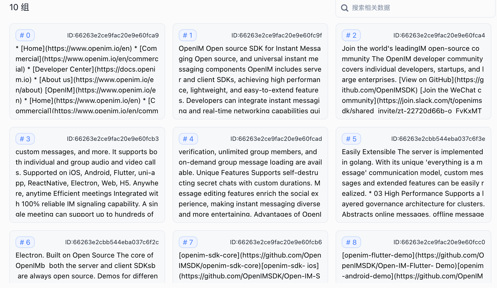
    </div>
    
    ```python
    def split_long_section(section, max_length=1300):
        lines = section.split('\n')
        current_section = ""
        result = []
        for line in lines:
            # Add 1 for newline character when checking the length
            if len(current_section) + len(line) + 1 > max_length:
                if current_section:
                    result.append(current_section)
                    current_section = line  # Start a new paragraph
                else:
                    # If a single line exceeds max length, treat it as its own paragraph
                    result.append(line)
            else:
                if current_section:
                    current_section += '\n' + line
                else:
                    current_section = line
    ```
    
2. **生成问答对**：
    
    切分后的chunk信息，总共`28`个chunk，每个chunk包含一对问答：
    <div align="center">
    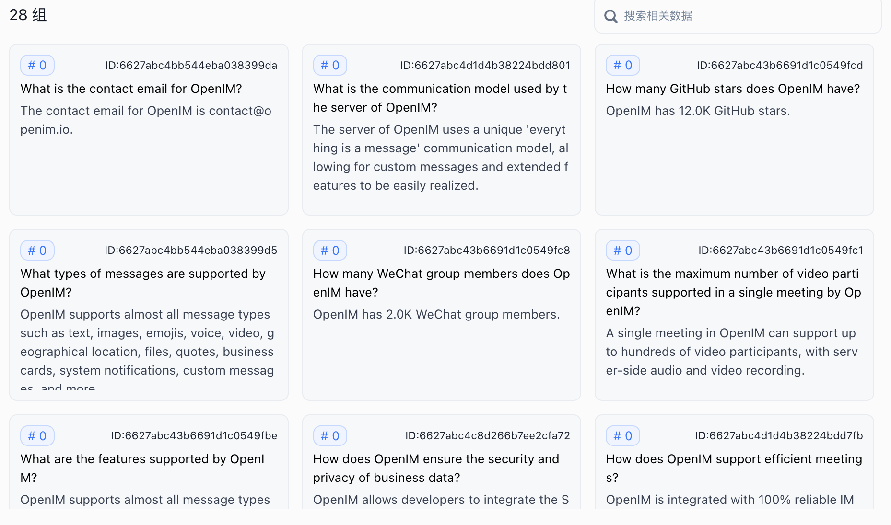
    </div>
    切分后的某个chunk的问答对信息：
    <div align="center">
    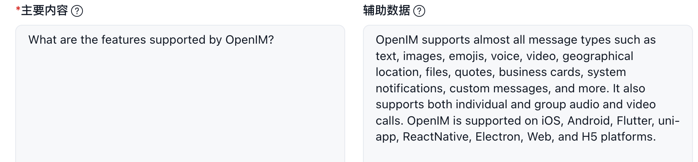
    </div>

3. **增强信息**：
    
    切分后的chunk信息，总共`6`个chunk，每个chunk都包含一批数据索引信息：
    <div align="center">
    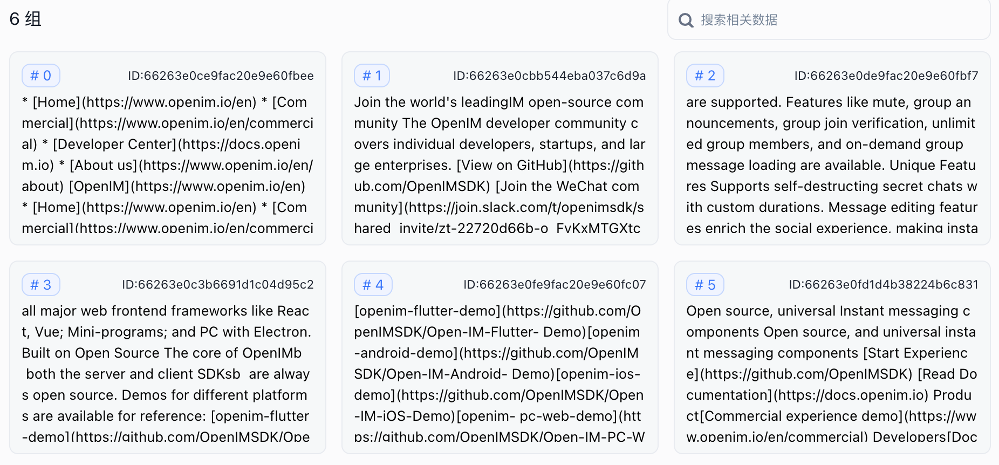
    </div>
    切分后的某个chunk的数据索引信息：
    <div align="center">
    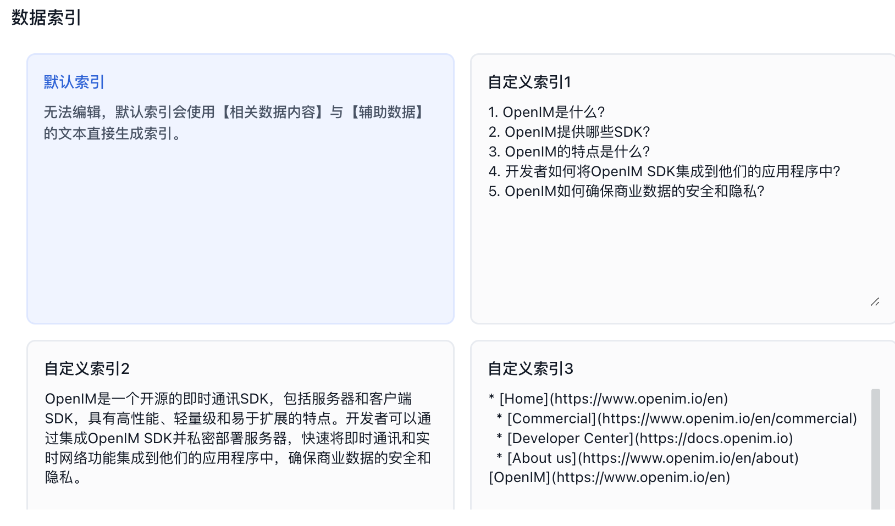
    </div>

##### 3.1.1.1 滑动窗口

平衡这些需求的一种简单方法是使用重叠的chunk。通过使用滑动窗口，可以增强语义过渡。然而，也存在一些限制，包括对上下文大小的控制不精确、有截断单词或句子的风险，以及缺乏语义考虑。

```python
final_result = []
ast_lines = ""
for section in result:
    lines = section.split('\n')
    last_two_lines = "\n".join(lines[-2:])  # Extract the last two lines
    combined_section = last_lines + "\n" + section if last_lines else section
    final_result.append(combined_section)
    last_lines = last_two_lines
```

##### 3.1.1.2 上下文丰富化

这里的概念是为了获得更好的搜索质量而检索较小的chunk，并添加周围的上下文供LLM进行推理。
有两个选项：通过在较小的检索chunk周围添加句子来扩展上下文，或者将文档递归地分成多个较大的父chunk，其中包含较小的子chunk。

**句子窗口检索**

在这个方案中，文档中的每个句子都被单独嵌入，这提供了查询与上下文余弦距离搜索的高准确性。
为了在获取到最相关的单个句子后更好地推理出找到的上下文，我们通过在检索到的句子之前和之后添加k个句子来扩展上下文窗口，然后将这个扩展后的上下文发送给LLM。

```python
from llama_index import ServiceContext, VectorStoreIndex, StorageContext
from llama_index.node_parser import SentenceWindowNodeParser

def build_sentence_window_index(
    document, llm, vector_store, embed_model="local:BAAI/bge-small-en-v1.5"
):
    # create the sentence window node parser w/ default settings
    node_parser = SentenceWindowNodeParser.from_defaults(
        window_size=3,
        window_metadata_key="window",
        original_text_metadata_key="original_text",
    )
    sentence_context = ServiceContext.from_defaults(
        llm=llm,
        embed_model=embed_model,
        node_parser=node_parser
    )
    storage_context = StorageContext.from_defaults(vector_store=vector_store)
    sentence_index = VectorStoreIndex.from_documents(
        [document], service_context=sentence_context, storage_context=storage_context
    )

    return sentence_index
```

**父文档检索器**

文档被分割成一个层次结构的chunk，然后最小的叶子chunk被发送到索引中。在检索时，我们检索k个叶子chunk，如果有n个chunk引用同一个父chunk，我们将它们替换为该父chunk并将其发送给LLM进行答案生成。

关键思想是将用于检索的chunk与用于合成的chunk分开。使用较小的chunk可以提高检索的准确性，而较大的chunk可以提供更多的上下文信息。具体来说，一种方法可以涉及检索较小的chunk，然后引用父ID以返回较大的chunk。或者，可以检索单个句子，并返回该句子周围的文本窗口。

<div align="center">
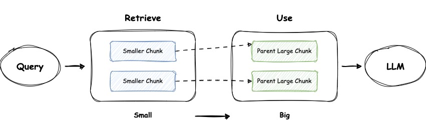
</div>

```python
sub_chunk_sizes = [128, 256, 512]
sub_node_parsers = [
    SimpleNodeParser.from_defaults(chunk_size=c) for c in sub_chunk_sizes
]

all_nodes = []
for base_node in base_nodes:
    for n in sub_node_parsers:
        sub_nodes = n.get_nodes_from_documents([base_node])
        sub_inodes = [
            IndexNode.from_text_node(sn, base_node.node_id) for sn in sub_nodes
        ]
        all_nodes.extend(sub_inodes)

    # also add original node to node
    original_node = IndexNode.from_text_node(base_node, base_node.node_id)
    all_nodes.append(original_node)
all_nodes_dict = {n.node_id: n for n in all_nodes}
```

##### 3.1.1.3 元数据附加

可以使用**元数据**信息对chunk进行丰富，例如`URL`、`文件名`、`作者`、`时间戳`、`摘要`，或者`chunk可以回答的问题`。随后，可以根据这些元数据对检索进行筛选，限制搜索范围。

```python
async def aadd_content_embedding(self, data):
    for item in data:
        documents_to_add = []  # Initialize a list to hold all document parts for batch processing.
        timestamp = int(time.time())
        doc_id, url, chunk_text_vec = item
        part_index = 0
        for part_content in chunk_text_vec:
            # Process each part of the content.
            # Construct metadata for each document part, ensuring each part has a unique ID.
            metadata = {"source": url, "id": f"{doc_id}-part{part_index}"}
            # Create a Document object with the part content and metadata.
            doc = Document(page_content=part_content, metadata=metadata)
            # Add the document part to the list for batch addition.
            documents_to_add.append(doc)
            part_index += 1

        # Check if there are document parts to add.
        if documents_to_add:
            # Add all document parts to Chroma in a single batch operation.
            embedding_id_vec = await self.chroma_obj.aadd_documents(documents_to_add)
            logger.info(f"[DOC_EMBEDDING] doc_id={doc_id}, url={url} added {len(documents_to_add)} document parts to Chroma., embedding_id_vec={embedding_id_vec}")
```

#### 3.1.2 向量化

在构建RAG应用程序时，**“使用哪个Embedding模型”**没有一个适用于所有情况的标准答案。实践中，我们选择的是OpenAI的`text-embedding-3-small`来计算chunk的向量。

```python
from langchain_openai import OpenAIEmbeddings

OPENAI_EMBEDDING_MODEL_NAME = os.getenv('OPENAI_EMBEDDING_MODEL_NAME', 'text-embedding-3-small')

# Initialize OpenAI embeddings with the specified model
g_embeddings = OpenAIEmbeddings(
    model=OPENAI_EMBEDDING_MODEL_NAME,
    openai_api_key=OPENAI_API_KEY
)
```

#### 3.1.3 搜索索引

#### 3.1.3.1 向量存储索引

RAG流程中的关键部分是搜索索引，存储chunk的向量化内容。最简单的实现使用平面索引，在查询向量和所有chunk向量之间进行距离计算。

一个优秀的搜索索引，需要确保在大规模元素上的检索效率，一般使用某种近似最近邻实现，如`聚类`、`树`或`HNSW算法`。

> NOTE:
> 
> 如果使用**Chroma**作为向量存储DB，需要留意`hnsw:space`的默认值是`l2`，实践中建议调整为`cosine`。

| Distance          | Parameter | Equation                                                              |
|-------------------|-----------|-----------------------------------------------------------------------|
| Squared L2        | 'l2'      | \$d = \sum\left(A_i-B_i\right)^2\$                                    |
| Inner product     | 'ip'      | \$d = 1.0 - \sum\left(A_i \times B_i\right)\$                         |
| Cosine similarity | 'cosine'  | \$d = 1.0 - \frac{\sum\left(A_i \times B_i\right)}{\sqrt{\sum\left(A_i^2\right)} \cdot \sqrt{\sum\left(B_i^2\right)}}\$ |

修改Chrome的`距离函数`：

create_collection接受一个可选的`metadata`参数，该参数可以用来通过设置`hnsw:space` 的值来自定义嵌入空间的距离方法。

```python
class DocumentEmbedder:

    def __init__(self, collection_name, embedding_function, persist_directory):
        logger.info(f"[DOC_EMBEDDING] init, collection_name:'{collection_name}', persist_directory:{persist_directory}")
        collection_metadata = {"hnsw:space": "cosine"}
        self.chroma_obj = Chroma(
                collection_name=collection_name,
                embedding_function=embedding_function,
                persist_directory=persist_directory,
                collection_metadata=collection_metadata)
```

除了向量索引，还可以考虑支持其它更简单的索引实现，如`列表索引`、`树索引`和`关键词表索引`。

#### 3.1.3.2 层级索引

如果需要从许多文档中检索信息，我们需要能够高效地在其中搜索，找到相关信息并将其合成一个带有来源引用的单一答案。对于大型数据库，一种有效的方法是创建两个索引，一个由摘要组成，另一个由文档chunk组成，并进行两步搜索，首先通过摘要筛选出相关文档，然后仅在这个相关组内进行搜索。

<div align="center">
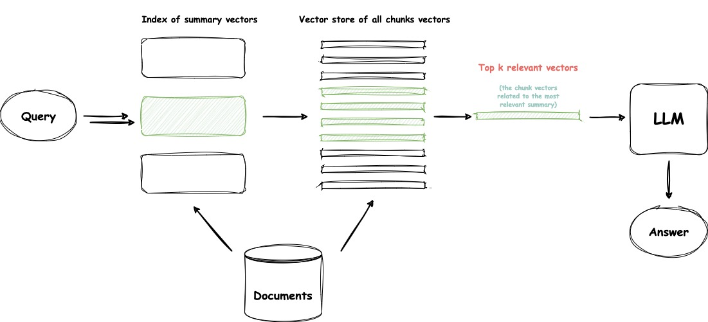
</div>

**层级索引**的应用实例：

* `LSM树（Log-Structured Merge-tree）`：LevelDB、RocksDB、Cassandra、HBase。
* `HNSW（Hierarchical Navigable Small World）`：Faiss、NMSlib、Annoy。

### 3.2 Preprocess Query

RAG的一个主要挑战是它直接依赖用户的原始查询作为检索的基础。制定一个精确和清晰的问题很难，而轻率的查询结果会导致检索效果不佳。

这一阶段的主要挑战包括：

* **措辞不当的查询**。问题本身复杂，语言组织不良。
* **语言复杂性和歧义**。语言模型在处理专业词汇或含义多义的模糊缩写时往往会遇到困难。

#### 3.2.1 Query Expansion

将单一查询扩展为多个查询可以丰富查询的内容，提供更多的上下文来解决缺乏特定细微差别的问题，从而确保生成答案的最佳相关性。

* **多查询**

    通过Prompt工程来扩展查询，这些查询可以并行执行。查询的扩展不是随机的，而是经过精心设计的。这种设计的两个关键标准是查询的多样性和覆盖范围。使用多个查询的一个挑战是可能稀释用户原始意图的风险。为了缓解这一问题，我们可以指导模型在Prompt工程中给予原始查询更大的权重。

* **子查询**

    子问题规划过程代表了生成必要的子问题，当结合起来时，这些子问题可以帮助完全回答原始问题。从原理上讲，这个过程与查询扩展类似。具体来说，一个复杂的问题可以使用从简到繁的提示方法分解为一系列更简单的子问题。

#### 3.2.2 Query Transformation

查询转换是一系列技术，使用LLM作为推理引擎修改用户输入以提高检索质量。有几种不同的方法可以实现这一点。

如果查询很复杂，LLM可以将其分解为几个子查询。例如，如果你问：

* “在Github上，[**private-gpt**](https://github.com/zylon-ai/private-gpt)和[**rag-gpt**](https://github.com/open-kf/rag-gpt)哪个项目的star更多？”，由于我们不太可能在语料库中的某些文本中找到直接的比较，因此将这个问题分解为两个子查询是有意义的，这些子查询假定了更简单和更具体的信息检索：
* “[**private-gpt**](https://github.com/zylon-ai/private-gpt)在Github上有多少star？”
* “[**rag-gpt**](https://github.com/open-kf/rag-gpt)在Github上有多少star？”

这些查询将并行执行，然后将检索到的上下文合并在一个提示中，供LLM合成对初始查询的最终答案。

<div align="center">
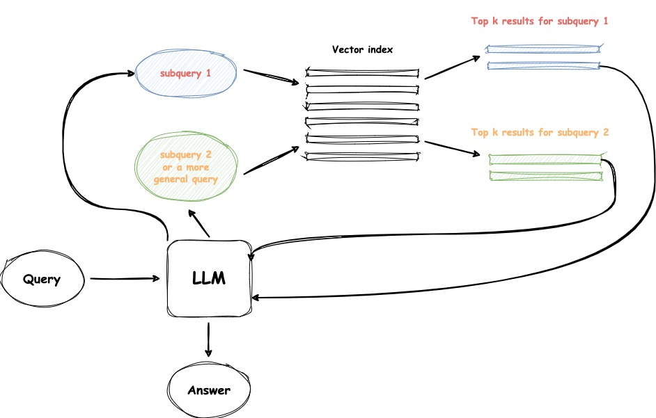
</div>

1. **退后式提示**，使用LLM生成一个更一般的查询，为其检索我们获得的更一般或高层次的上下文，有助于支撑我们对原始查询的回答。也会对原始查询执行检索，两种上下文都会在最终答案生成步骤中输入到LLM中。
2. **查询重写**，原始查询并不总是最适合LLM检索的，特别是在现实世界的场景中。因此，我们可以提示LLM重写查询。

[**OpenIM文档网站**](https://docs.openim.io/)使用[**rag-gpt**](https://github.com/open-kf/rag-gpt)搭建了网站智能客服，可以快速验证**查询重写**策略的效果。

* 在没有**查询重写**策略时，如果用户输入`"如何部署"`，召回的文档的相关性分数都小于`0.5`，会都被过滤掉，最后GPT无法获得足够的上下文信息，无法回答。

<div align="center">
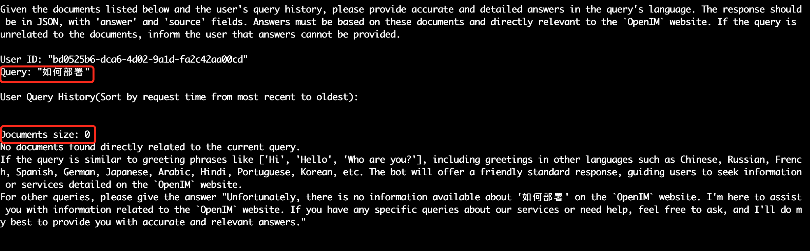
</div>

<div align="center">
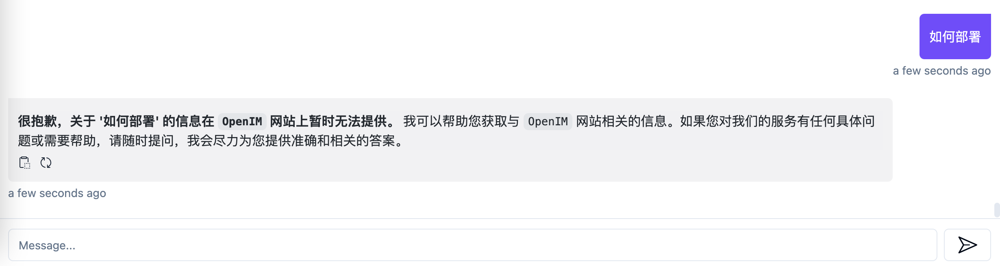
</div>

* 增加**查询重写**策略时，如果用户输入`"如何部署"`，query会被改写为`"如何部署\tOpenIM"`，此时召回的5篇文档的相关性分数都是大于0.5的，可以作为上下文传给GPT，最终GPT给出响应的答案。

    <div align="center">
    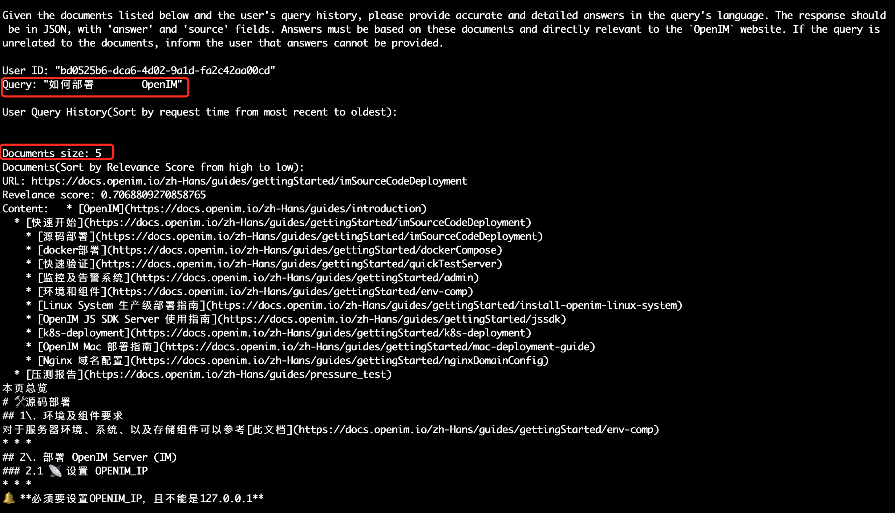
    </div>
    
    <div align="center">
    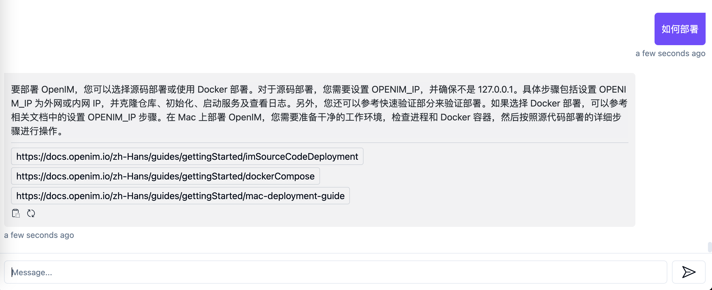
    </div>
    
    ```python
    def preprocess_query(query, site_title):
        # Convert to lowercase for case-insensitive comparison
        query_lower = query.lower()
        site_title_lower = site_title.lower()
        # Check if the site title is already included in the query
        if site_title_lower not in query_lower:
            adjust_query =  f"{query}\t{site_title}"
            logger.warning(f"adjust_query:'{adjust_query}'")
            return adjust_query
        return query
    ```

#### 3.2.3 Query Construction

将用户查询转换成其他查询语言以访问替代数据源。常见的方法包括：

* 文本转Cypher
* 文本转SQL

在许多场景中，结构化查询语言（例如，SQL、Cypher）常与语义信息和元数据结合使用，以构建更复杂的查询。

#### 3.2.4 Query Routing

查询路由是一个基于LLM的决策制定步骤，针对用户的查询决定接下来要做什么。通常的选项包括进行总结、对某些数据索引执行搜索，或尝试多种不同的路由然后将它们的输出合成一个答案。

查询路由器也用于选择一个索引，或者更广泛地说，一个数据存储位置，来发送用户查询。无论是你拥有多个数据源，例如经典的向量存储、图数据库或关系数据库，还是你拥有一个索引层级。对于多文档存储来说，一个典型的案例可能是一个摘要索引和另一个文档chunk向量索引。

定义查询路由器包括设置它可以做出的选择。路由选项的选择是通过LLM调用执行的，其结果以预定义格式返回，用于将查询路由到给定的索引，或者，如果我们谈论的是族群行为，路由到子链或甚至如下所示的多文档代理方案中的其他代理。

```python
from langchain.utils.math import cosine_similarity
from langchain_core.output_parsers import StrOutputParser
from langchain_core.prompts import PromptTemplate
from langchain_core.runnables import RunnableLambda, RunnablePassthrough
from langchain_openai import OpenAIEmbeddings

physics_template = f"""You are a very smart physics professor.
You are great at answering questions about physics in a concise and easy to understand manner.
When you don't know the answer to a question you admit that you don't know.

Here is a question:
{query}"""

math_template = f"""You are a very good mathematician. You are great at answering math questions.
You are so good because you are able to break down hard problems into their component parts,
answer the component parts, and then put them together to answer the broader question.

Here is a question:
{query}"""

embeddings = OpenAIEmbeddings()
prompt_templates = [physics_template, math_template]
prompt_embeddings = embeddings.embed_documents(prompt_templates)

def prompt_router(input):
    query_embedding = embeddings.embed_query(input["query"])
    similarity = cosine_similarity([query_embedding], prompt_embeddings)[0]
    most_similar = prompt_templates[similarity.argmax()]
    print("Using MATH" if most_similar == math_template else "Using PHYSICS")
    return PromptTemplate.from_template(most_similar)

chain = (
    {"query": RunnablePassthrough()}
    | RunnableLambda(prompt_router)
    | ChatAnthropic(model_name="claude-3-haiku-20240307")
    | StrOutputParser()
)
```

### 3.3 检索

在RAG中，检索过程扮演着至关重要的角色。利用预训练语言模型可以有效地表示查询和文本在潜在空间中，从而促进问题和文档之间的语义相似性建立，以支持检索。

需要考虑以下三个主要因素：

* **检索效率**：检索过程应该高效，能够快速地返回相关的文档或答案。这要求在检索过程中采用高效的算法和数据结构，以及优化的索引和查询方法。
* **嵌入质量**：嵌入向量应该能够准确地捕捉文本的语义信息。这要求使用高质量的预训练语言模型，以确保生成的嵌入向量能够在潜在空间中准确地表示文本的语义相似性。
* **任务、数据和模型的对齐**：检索过程需要根据具体的任务需求和可用的数据来选择合适的模型和方法。任务、数据和模型之间的对齐是关键，可以通过合理的数据预处理、模型选择和训练来提高检索的效果。

#### 3.3.1 稀疏检索器

虽然稀疏编码模型可能被认为是一种有些过时的技术，通常基于统计方法，如词频统计，但由于其更高的编码效率和稳定性，它们仍然占有一席之地。常见的系数编码模型包括`BM25`和`TF-IDF`。

#### 3.3.2 密集检索器

基于神经网络的密集编码模型包括几种类型：

* 基于BERT架构构建的编码器-解码器语言模型，如`ColBERT`。
* 综合多任务微调模型，如`BGE文本嵌入`。
* 基于云API的模型，如`OpenAI-Ada-002`和`Cohere Embedding`。

#### 3.3.3 混合检索

两种嵌入方法捕获不同的相关性特征，并且通过利用互补的相关性信息，可以相互受益。例如，稀疏检索模型可以用来提供训练密集检索模型的初步搜索结果。此外，预训练语言模型可以用来学习术语权重以增强稀疏检索。具体来说，它还表明稀疏检索模型可以增强密集检索模型的零样本检索能力，并帮助密集检索器处理包含罕见实体的查询，从而提高鲁棒性。

### 3.4 Post-Retrieval

直接检索整个文档chunk并将它们直接输入到LLM的上下文环境中并非最佳选择。后处理文档可以帮助LLM更好地利用上下文信息。

主要挑战包括：

* **丢失中间部分**。像人类一样，LLM倾向于只记住长文本的开始和结束部分，而忘记中间部分。
* **噪声/反事实chunk**。检索到的噪声多或事实上矛盾的文档可能会影响最终的检索生成。
* **上下文窗口**。尽管检索到了大量相关内容，但大型模型中对上下文信息长度的限制阻止了包含所有这些内容。


#### 3.4.1 Reranking

不改变内容或长度的情况下，对检索到的文档chunk进行重新排序，以增强对LLM更为关键的文档chunk的可见性。具体来说：

1. **基于规则的重新排序**
    
    根据特定规则，计算度量来重新排序chunk。常见的度量包括：
    
    * 多样性
    * 相关性
    * 最大边际相关性（Maximal Marginal Relevance）
    
    `MMR`的背后思想是减少冗余并增加结果的多样性，它用于文本摘要。`MMR`根据查询相关性和信息新颖性的组合标准选择最终关键短语列表中的短语。

2. **Model-base Rerank**

    使用语言模型对文档chunk进行重新排序，可选方案包括：
    
    * 来自BERT系列的编解码器模型，如`SpanBERT`。
    * 专门的重新排序模型，如`Cohere rerank`或`bge-reranker-large`。
    * 通用大型语言模型，如`GPT-4`。

#### 3.4.2 过滤

在RAG过程中，一个常见的误解是认为检索尽可能多的相关文档并将它们连接起来形成一个冗长的检索提示是有益的。然而，过多的上下文可能会引入更多噪声，削弱LLM对关键信息的感知，导致如“中间丢失”等问题。

我们可以基于相似度分数、关键词、元数据过滤结果，将一些低质的文档过来到，不传递到LLM的上下文中。

这是在将我们检索到的上下文输入LLM以获取最终答案之前的最后一步。

```python
def search_document(self, query, k):
    # Return docs and relevance scores in the range [0, 1].
    # 0 is dissimilar, 1 is most similar.
    return self.chroma_obj.similarity_search_with_relevance_scores(query, k=k)
```

使用`similarity_search_with_relevance_scores(query: str, k: int = 4, **kwargs: Any) → List[Tuple[Document, float]]`来从`Chroma`中召回文档，并返回**relevance score**，可以根据业务具体需求场景和测试日志，设置`MIN_RELEVANCE_SCORE`，过滤掉**低质**的文档。

```python
    # Build the context for prompt
    recall_domain_set = set()
    filtered_results = []
    for doc, score in results:
        if score > MIN_RELEVANCE_SCORE:
            filtered_results.append((doc, score))
            domain = urlparse(doc.metadata['source']).netloc
            recall_domain_set.add(domain)

    if filtered_results:
        filtered_context = "\n--------------------\n".join([
            f"URL: {doc.metadata['source']}\nRevelance score: {score}\nContent: {doc.page_content}"
            for doc, score in filtered_results
        ])
        context = f"""Documents size: {len(filtered_results)}
Documents(Sort by Relevance Score from high to low):
{filtered_context}"""
    else:
        context = f"""Documents size: 0
No documents found directly related to the current query.
If the query is similar to greeting phrases like ['Hi', 'Hello', 'Who are you?'], including greetings in other languages such as Chinese, Russian, French, Spanish, German, Japanese, Arabic, Hindi, Portuguese, Korean, etc. The bot will offer a friendly standard response, guiding users to seek information or services detailed on the `{site_title}` website.
For other queries, please give the answer "Unfortunately, there is no information available about '{query}' on the `{site_title}` website. I'm here to assist you with information related to the `{site_title}` website. If you have any specific queries about our services or need help, feel free to ask, and I'll do my best to provide you with accurate and relevant answers."
"""
```

#### 3.4.3 参考引用

这个更多是一种工具而非检索改进技术，尽管它非常重要。
如果我们使用了多个来源来生成答案，可能是由于初始查询的复杂性（我们不得不执行多个子查询，然后将检索到的上下文合并成一个答案），或者因为我们在不同的文档中找到了单个查询的相关上下文，那么就会出现一个问题，即我们是否能准确地反向引用我们的来源。

有几种方法可以做到这一点：

1. 将这个引用任务插入到我们的提示中，并要求LLM提及所使用来源的ID。
2. 将生成的响应的部分与我们索引中的原始文本chunk进行匹配。

```python
prompt = f"""
Given the documents listed below and the user's query history, please provide accurate and detailed answers in the query's language. The response should be in JSON, with 'answer' and 'source' fields. Answers must be based on these documents and directly relevant to the `{site_title}` website. If the query is unrelated to the documents, inform the user that answers cannot be provided.

User ID: "{user_id}"
Query: "{query}"

User Query History(Sort by request time from most recent to oldest):
{history_context}

{context}

Response Requirements:
- If unsure about the answer, proactively seek clarification.
- Refer only to knowledge related to `{site_title}` website's content.
- Inform users that queries unrelated to `{site_title}` website's content cannot be answered and encourage them to ask site-related queries.
- Ensure answers are consistent with information on the `{site_title}` website.
- Use Markdown syntax to format the answer for readability.
- Responses must be crafted in the same language as the query.

The most important instruction: Please do not provide any answers unrelated to the `{site_title}` website! Regardless of whether the bot know the answer or not! This instruction must be followed!

Please format your response as follows:
{{
    "answer": "A detailed and specific answer, crafted in the query's language.",
    "source": ["Unique document URLs directly related to the answer. If no documents are referenced, use an empty list []."]
}}
"""
```

#### 3.4.5 会话历史

关于构建一个能够针对单一查询多次工作的优秀RAG系统的下一个重大事项是聊天逻辑，这一点与前LLM时代经典聊天机器人中的对话上下文相同。
这是为了支持后续问题、指代或与先前对话上下文相关的任意用户命令所必需的。这通过查询压缩技术来解决，同时考虑聊天上下文和用户查询。

关于上述上下文压缩，总有几种方法。

1. 一个流行且相对简单的是`ContextChatEngine`，首先检索与用户查询相关的上下文，然后将其连同聊天历史记录从内存缓冲区发送给LLM，以便LLM在生成下一个答案时了解之前的上下文。
2. 更复杂的案例是`CondensePlusContextMode`，在每次互动中，聊天历史和最后一条消息被压缩成新的查询，然后这个查询进入索引，检索到的上下文连同原始用户消息一起传递给LLM以生成答案。

<div align="center">
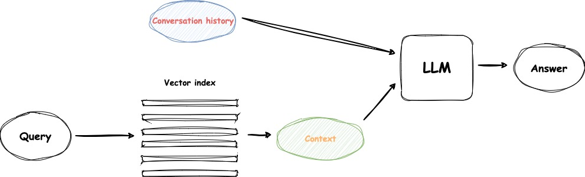
</div>

```python
def get_user_query_history(user_id):
    history_key = f"open_kf:query_history:{user_id}"
    history_items = g_diskcache_client.get_list(history_key)[::-1]
    history = [json.loads(item) for item in history_items]
    return history

# Get history session from Cache
history_session = get_user_query_history(user_id)
# Build the history_context for prompt
history_context = "\n--------------------\n".join([f"Previous Query: {item['query']}\nPrevious Answer: {item['answer']}" for item in history_session])
```

### 3.5 生成

利用LLM根据用户的查询和检索到的上下文信息生成答案。

#### 3.5.1 LLM模式

根据场景的不同，LLM的选择可以分为以下两种类型：

1. **云API基础生成器**。通过调用第三方LLM的API来使用，如OpenAI的`gpt-3.5-turbo`、`gpt-4-turbo`和百度的`ERNIE-Bot-turbo`等。

    优点包括：

    * 没有服务器压力
    * 高并发性
    * 能够使用更强大的模型

    缺点包括：

    * 数据通过第三方，可能引起数据隐私问题
    * 无法调整模型（在绝大多数情况下）

2. **本地部署**
本地部署开源或自行开发的LLM，如`Llama`系列、`GLM`等。其优点和缺点与基于云API的模型相反。本地部署的模型提供了更大的灵活性和更好的隐私保护，但需要更高的计算资源。

#### 3.5.2 响应合成器

这是RAG流程的最后一步，根据我们仔细检索的所有上下文和初始用户查询生成答案。
最简单的方法就是将所有获取的上下文（超过某个相关性阈值）与查询一起连接起来，并一次性输入到LLM中。
然而，像往常一样，还有其他更复杂的选项，涉及多次LLM调用来优化检索到的上下文并生成更好的答案。

响应综合的主要方法有：

1. 通过将检索到的上下文逐chunk送入LLM，迭代地完善答案。
2. 将检索到的上下文进行总结，以适应提示。
3. 基于不同的上下文chunk生成多个答案，然后将它们连接或进行总结。

#### 3.5.3 Postprocess Response

如果不是采用流式输出，在获取到LLM生成的结果后，我们可以根据具体业务场景，进行最后干预。
比如[**OpenIM文档网站**](https://docs.openim.io/)的网站客服机器人，只需要回答和OpenIM网站相关的问题，如果用户咨询其它问题或者LLM给出了和网站无关的答案，都需要进行结果干预。

<div align="center">
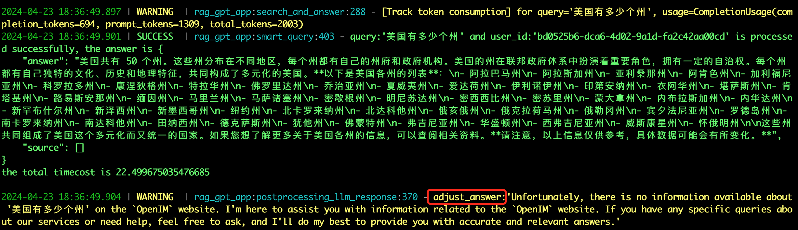
</div>

<div align="center">
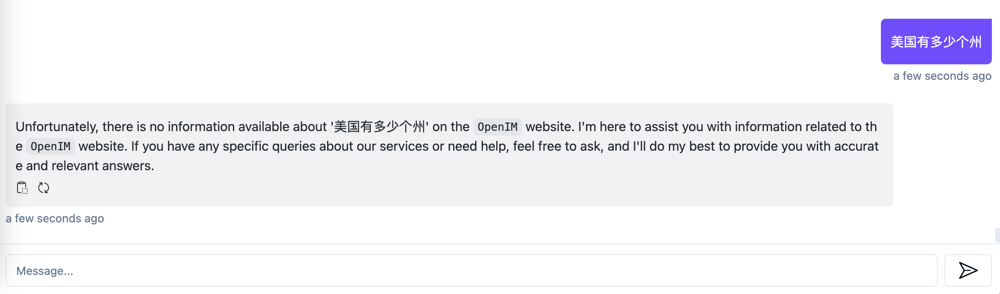
</div>

```python
def postprocess_llm_response(query, answer_json, site_title, recall_domain_set):
    if answer_json['source']:
        answer_json['source'] = list(dict.fromkeys(answer_json['source']))

    is_adjusted = False
    adjust_source = []
    for url in answer_json['source']:
        domain = urlparse(url).netloc
        if domain in recall_domain_set:
            adjust_source.append(url)
        else:
            logger.warning(f"url:'{url}' is not in {recall_domain_set}, it should not be returned!")
            if not is_adjusted:
                is_adjusted = True

    if is_adjusted:
        answer_json['source'] = adjust_source
        logger.warning(f"adjust_source:{adjust_source}")

    if not adjust_source:
        if site_title not in answer_json['answer']:
            adjust_answer = f"Unfortunately, there is no information available about '{query}' on the `{site_title}` website. I'm here to assist you with information related to the `{site_title}` website. If you have any specific queries about our services or need help, feel free to ask, and I'll do my best to provide you with accurate and relevant answers."
            logger.warning(f"adjust_answer:'{adjust_answer}'")
            if not is_adjusted:
                is_adjusted = True
            answer_json['answer'] = adjust_answer
    return is_adjusted
```


## 四、RAG评估

RAG在自然语言处理领域的快速进展和日益普及，将RAG模型的评估推到了LLM社区研究的前沿。评估RAG模型的主要目标是理解和优化其在不同应用场景下的性能。这里主要介绍RAG的主要下游任务、数据集以及如何评估RAG系统。

### 4.1 下游任务

RAG的核心任务仍然是`问答（QA）`，包括传统的`单跳/多跳QA`、`多项选择题`、`领域特定的QA`以及`适用于RAG的长篇场景`。除了QA，RAG还不断扩展到多个下游任务，如`信息抽取`、`对话生成`、`代码搜索`等。

### 4.2 评估目标

目前对RAG模型的评估主要集中在其在特定下游任务中的执行上。这些评估使用适合具体任务的已建立的**评估指标**。例如，问答任务的评估可能依赖于`EM`和`F1分数`，而事实核查任务通常以准确度为主要指标。

主要的评估目标包括：

* **检索质量**：评估检索质量对于确定检索组件提取的上下文的有效性至关重要。使用来自搜索引擎、推荐系统和信息检索系统领域的标准指标来衡量RAG检索模块的性能。常用的指标包括`命中率`、`MRR`和`NDCG`等。

* **生成质量**：生成质量的评估关注生成器从检索到的上下文中合成连贯和相关的答案的能力。根据内容的目标，这种评估可以分为无标签内容和有标签内容两种。对于无标签内容，评估包括生成答案的`忠实度`、`相关性`和`无害性`。相反，对于有标签内容，重点是模型生成的信息`准确性`。此外，检索和生成质量的评估可以通过人工或自动评估方法进行。

综上所述，RAG模型的评估涉及检索质量和生成质量的评估，并使用特定任务的评估指标进行衡量。评估可以采用手动或自动评估方法。

### 4.3 评估方面

RAG模型的评估实践强调三个主要的质量得分和四个基本能力，共同为RAG模型的两个主要目标进行评估：**检索**和**生成**。

1. **质量得分**：质量得分包括`上下文相关性`、`答案忠实度`和`答案相关性`。这些质量得分从不同的角度评估RAG模型在信息检索和生成过程中的效率。
    * 上下文相关性评估检索到的上下文的精确性和特异性，确保相关性并减少与无关内容相关的处理成本。
    * 答案忠实度确保生成的答案与检索到的上下文保持一致，避免矛盾。
    * 答案相关性要求生成的答案与提出的问题直接相关，有效回答核心问题。
    
2. **所需能力**：RAG的评估还涵盖了四个能力，这些能力表明其适应性和效率：`噪声鲁棒性`、`负样本拒绝`、`信息整合`和`反事实鲁棒性`。这些能力对于模型在各种挑战和复杂场景下的性能至关重要，影响着质量得分。
    * 噪声鲁棒性评估模型处理与问题相关但缺乏实质信息的噪声文档的能力。
    * 负样本拒绝评估模型在检索到的文档中不包含回答问题所需知识时的判断能力，避免回答无法回答的问题。
    * 信息整合评估模型从多个文档中合成信息以回答复杂问题的能力。
    * 反事实鲁棒性测试模型在文档中识别和忽略已知的不准确信息的能力，即使在知道存在潜在错误信息的情况下也能正确处理。

上下文相关性和噪声鲁棒性对于评估检索的质量非常重要，而答案忠实度、答案相关性、负样本拒绝、信息整合和反事实鲁棒性对于评估生成的质量非常重要。

需要注意的是，这些指标是从相关工作中得出的传统度量，尚不能代表一种成熟或标准化的方法来量化RAG评估方面。一些评估研究还开发了针对RAG模型的定制指标，尽管这些指标在此处未包含在内。

### 4.4 评估基准和工具

有几种用于评估RAG系统性能的框架，它们分享了使用几个独立指标的思想，例如`整体答案相关性`、`答案忠实度`、`准确性`和`检索到的上下文相关性`。

[**Ragas**](https://docs.ragas.io/en/stable/)，使用`忠实度`和`答案相关性`作为生成答案质量的指标，而对于RAG模型的检索部分，则使用上下文的`精确率`和`召回率`。

[**Truelens**](https://www.trulens.org/)，提出了**RAG三元组**：

* 检索到的上下文与查询的相关性。
* 忠实度（LLM答案在提供的上下文中的支持程度）。
* 答案与查询的相关性。

RAG流程中的关键且最可控的指标是**检索到的上下文相关性**，而响应合成器和LLM微调则专注于答案相关性和忠实度。

## 五、总结与展望

目前RAG技术取得了较大进展，主要体现在以下几个方面：

* **增强的数据获取**：RAG已经超越了传统的非结构化数据，现在包括半结构化和结构化数据，重点是对结构化数据进行预处理，以改善检索并减少模型对外部知识源的依赖。
* **整合的技术**：RAG正在与其它技术整合，包括使用微调、适配器模块和强化学习来增强检索能力。
* **可调适的检索过程**：检索过程已经发展到支持多轮检索增强，利用检索内容指导生成过程，反之亦然。此外，自主判断和LLM的使用通过确定是否需要检索，提高了回答问题的效率。

在生产环境中，除了答案相关性和忠实度之外，RAG系统面临的主要挑战是**响应速度**和**健壮性**。

RAG的应用范围正在扩展到**多模态领域**，将其原理应用于解释和处理图片、视频和代码等多种数据形式。这一拓展突显了RAG在人工智能部署中的重要实际意义，吸引了学术界和工业界的兴趣。以RAG为中心的人工智能应用和支持工具的不断发展证明了RAG生态系统的壮大。随着RAG应用领域的扩大，有必要完善评估方法学，以跟上其发展的步伐。确保准确而具有代表性的性能评估对于充分捕捉RAG对人工智能研究与开发社区的贡献至关重要。

<br/>
<br/>
<br/>


## 关于我们
[**OpenIM**](https://www.openim.io/en)是领先的开源即时通讯（IM）平台，目前在GitHub上的星标已超过13k。随着数据和隐私安全的重视以及信息技术的快速发展，政府和企业对于私有部署的IM需求急剧增长。OpenIM凭借“安全可控”的特点，在协同办公软件市场中占据了一席之地。在后AIGC时代，IM作为人机交互的首要接口，其价值愈发重要，OpenIM期待在此时代扮演更关键的角色。

基于这样的视角，我们最近开源了**RAG-GPT**项目，已被部分企业采用并持续完善中。RAG-GPT的主要特点包括：

* **内置LLM支持**：集成大型语言模型，提升对话质量。
* **快速部署**：五分钟内可部署生产级对话服务。
* **简便维护**：基于Python，无需额外中间件。
* **灵活配置**：可定制的管理控制台，简化操作。
* **精美界面**：提供吸引人的用户界面设计。

如果您对RAG-GPTg感兴趣，可以访问以下链接了解更多信息：

项目地址：
https://github.com/open-kf/rag-gpt

在线Demo：
https://demo.rentsoft.cn/

我们的目标是改进文件管理功能，更有效地管理数据，并整合企业级知识库。欢迎大家在GitHub上Star并关注，支持我们的开源旅程。

开源说明：RAG-GPT采用Apache 2.0许可，支持免费使用和二次开发。遇到问题时，请在GitHub提Issue或加入我们的`OpenKF开源社区群`讨论。如果您需要更智能的客服系统，请与我们联系。

<div align="center">

</div>
